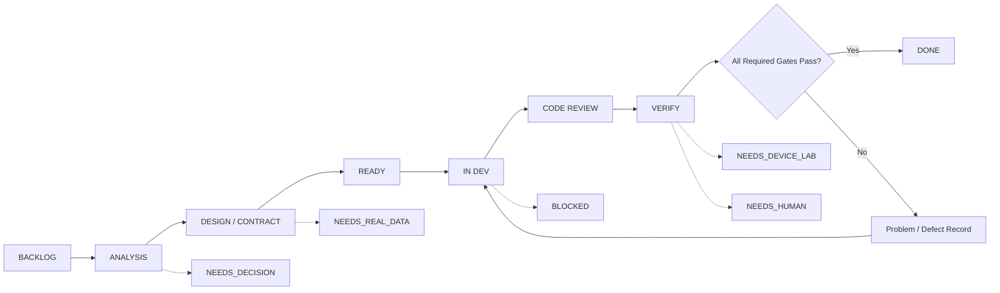
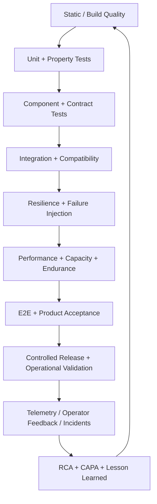
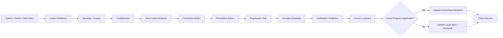
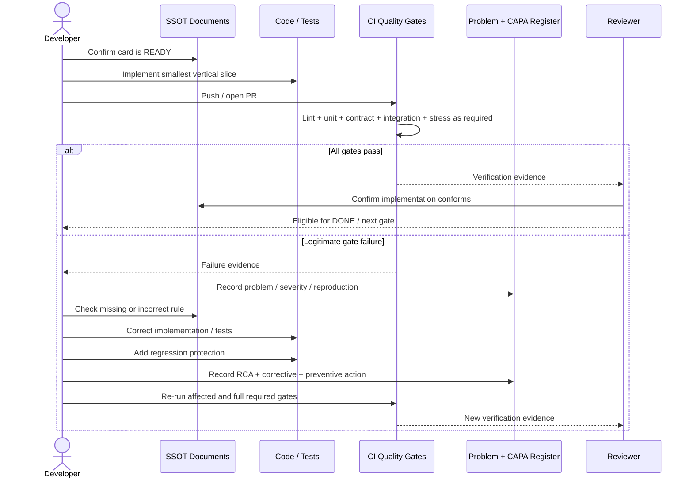
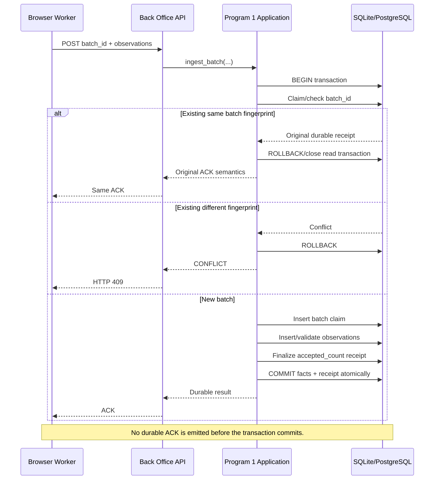

# Development Cycle Diagrams

Status: GOVERNING VISUAL REFERENCE
Date: 2026-08-31
Companion policy: `DEVELOPMENT_CYCLE_STANDARD.md`

## 1. Closed-Loop Development Lifecycle

```mermaid
flowchart LR
    A[Need / Problem / Goal] --> B[Evidence / Context]
    B --> C[Document / ADR / Contract]
    C --> D{Definition of Ready}
    D -- Not Ready --> C
    D -- Ready --> E[Kanban READY]
    E --> F[Implement Small Vertical Slice]
    F --> G[Developer Verification]
    G --> H[Static + Automated Gates]
    H --> I[Adversarial / Failure Tests]
    I --> J[Code + Architecture Review]
    J --> K[Integration / Compatibility]
    K --> L{Release / Acceptance Gate}
    L -- Fail --> M[Problem Record + RCA]
    L -- Pass --> N[Controlled Release / Product Acceptance]
    N --> O[Observe Telemetry / Feedback]
    O --> P{Issue / Lesson?}
    P -- No --> Q[DONE / Operate]
    P -- Yes --> M
    M --> R[Corrective Action]
    R --> S[Preventive Action]
    S --> T[Regression Test / Guardrail]
    T --> U[Update Documents / ADR / Config / Runbook]
    U --> C
```

## 2. Kanban State and Quality Gates

## 3. Product Verification Pyramid and Operational Loop

## 4. Defect-to-Prevention Feedback Loop

## 5. CI Failure Sequence

## 6. Durable Ingestion Transaction — Program 1 Reference

## 7. Diagram Usage Rule

When a new workflow has multiple components, irreversible effects, retries, concurrency, durable acknowledgement, or recovery behavior, the responsible design card must add or update an appropriate sequence/activity/state/integration diagram before Implementation Ready.
