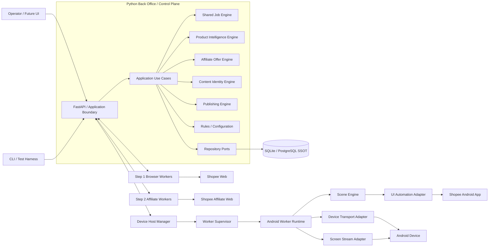
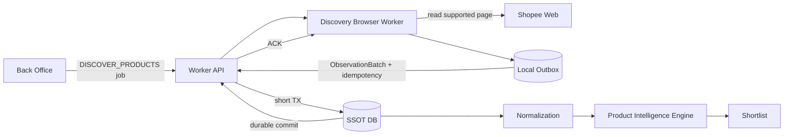
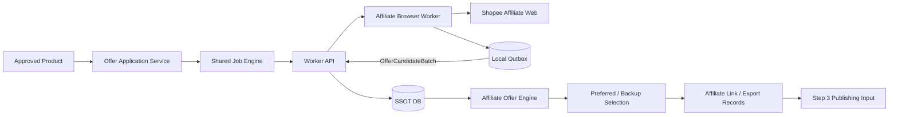
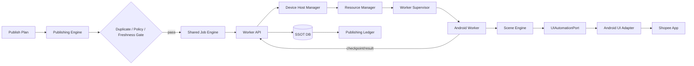
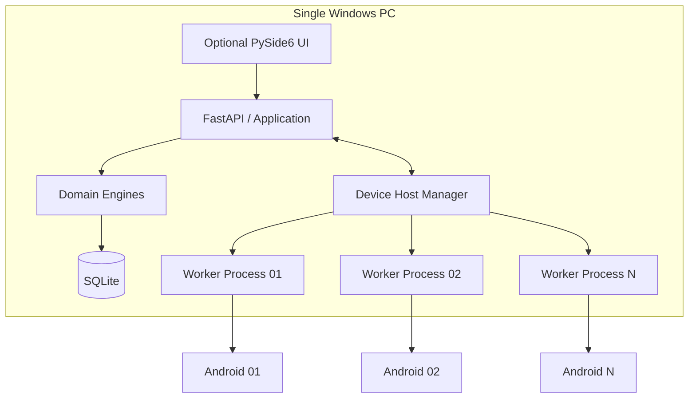
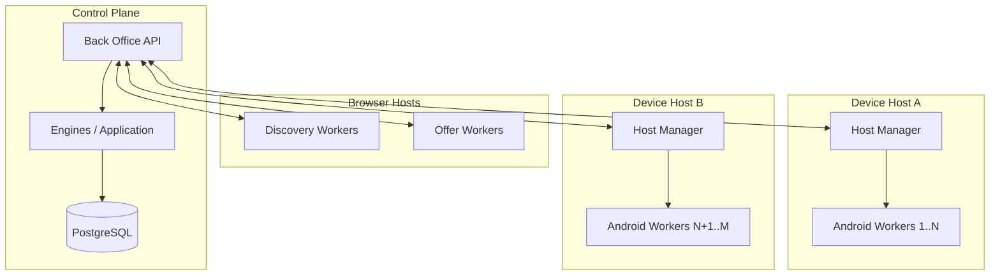
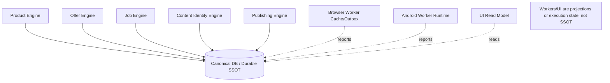
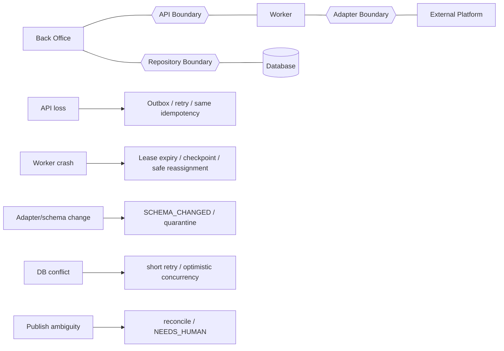
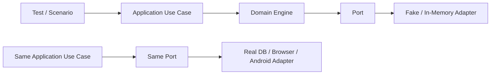

# Integration Architecture Diagrams

Status: IMPLEMENTATION HANDOFF BASELINE
Date: 2026-08-31
Governing rule: Project must follow the document.

## 1. Purpose

This document defines how the major components of MTAffiliatePlatform integrate at logical, runtime, protocol and data-flow levels.

It complements:
- `WORKFLOW.md` — canonical business workflow/pipeline;
- `SYSTEM_DIAGRAMS.md` — context/component/deployment/state views;
- `SEQUENCE_DIAGRAMS.md` — interaction timing and failure paths;
- `API_COMMUNICATION_AND_PLUGIN_ARCHITECTURE.md` — communication contract rules.

Integration design must preserve:
- one durable business SSOT;
- API-as-core;
- engine-first/headless-first architecture;
- pluggable adapters;
- explicit ACK/idempotency/retry boundaries;
- failure isolation;
- testability without live external systems.

---

## 2. Enterprise / Logical Integration Diagram

### Authority rule
- Engines own business decisions/policies.
- Application layer coordinates use cases.
- Adapters translate external technology specifics.
- Database owns durable canonical state.
- UI/CLI/worker local state is never business SSOT.

---

## 3. Canonical Business Pipeline / Step Integration

```mermaid
flowchart LR
  S[Strategy / Rules] --> D[Step 1 Discovery]
  D --> N[Normalize / Dedupe]
  N --> PI[Product Intelligence]
  PI --> PL[Product Shortlist / Approval]
  PL --> OD[Step 2 Offer Discovery]
  OD --> OR[Offer Eligibility / Ranking]
  OR --> OS[Preferred + Backup Offer Selection]
  OS --> VR[Video Registry / Fingerprint]
  VR --> MATCH[Product + Offer + Video Match]
  MATCH --> PP[Publish Plan]
  PP --> G[Duplicate / Freshness / Policy Gate]
  G --> J[Shared Job Queue]
  J --> DH[Device Host]
  DH --> AW[Android Worker]
  AW --> V[Publish Verification]
  V --> L[Publishing Ledger]
  L --> A[Analytics / Attribution]
  A --> S
```

### Step handoff principle
Steps exchange canonical IDs and versioned contracts, not worker memory or UI-specific state.

---

## 4. Step 1 Integration — Product Discovery

Integration invariants:
- observation batch persists locally before send;
- ACK only after durable Back Office commit;
- canonical dedupe happens centrally;
- Product Intelligence never depends directly on browser DOM.

---

## 5. Step 2 Integration — Affiliate Offer Discovery

Integration invariants:
- affiliate account/session provenance is part of observations when context-sensitive;
- commercial ranking occurs only in Back Office;
- Shared Core jobs remain lifecycle SSOT.

---

## 6. Step 3 Integration — Publishing / Android Device Farm

Integration invariants:
- one active worker per device;
- Device Host Manager owns device/resource lifecycle;
- worker reports facts; Back Office owns durable transitions;
- no SQL transaction waits on Android/Shopee actions;
- POST outcome ambiguity never triggers blind repost.

---

## 7. Runtime Integration — Portable Mode

Portable mode is one deployment unit, not one monolithic process.

---

## 8. Runtime Integration — Farm Mode

Horizontal growth must not require redesign of domain engines or canonical data models.

---

## 9. Protocol Integration Matrix

| Integration | Baseline Protocol | Authoritative? | Reliability mechanism |
|---|---|---:|---|
| UI/CLI -> Application | in-process command/query or HTTP | No | application validation |
| External client -> Back Office | REST/HTTP `/api/v1` | command/query boundary | idempotency + DB transaction |
| Worker -> Back Office results | REST/HTTP batch | Yes after commit | local outbox + durable ACK |
| Back Office -> Worker job | REST lease/poll baseline | job state in DB | lease token + expiry + version |
| Live telemetry | WebSocket | No | reconnect/snapshot refresh |
| Application -> DB | SQLAlchemy Repository/UoW | Yes | transaction + constraints |
| Device Host -> Worker | local IPC/process control | No | supervisor + heartbeat |
| Worker -> Android | adapter-specific ADB/UI automation | No | action verification/checkpoint |
| Screen streaming | scrcpy/STF-style adapter | No | reconnect/degrade |

Key rule: **WebSocket presence, screen stream state, and worker memory are never durable business truth.**

---

## 10. Data Ownership / SSOT Integration Diagram

Authoritative durable areas include:
- canonical products and observations;
- affiliate offers and selections;
- jobs/job events/leases/checkpoints;
- videos/content identities;
- publishing ledger;
- versioned rules/configuration decisions.

---

## 11. Integration Failure Boundaries

Failure in one boundary must not silently mutate another boundary's authoritative state.

---

## 12. Test Integration Architecture

The same engine/application code must run against fake and real adapters. This is the core testability rule.

---

## 13. Integration Readiness Checklist

A component integration is not implementation-ready until all are explicit:
1. caller and callee;
2. command/query/event name;
3. request/response schema version;
4. canonical identity fields;
5. authoritative state owner;
6. sync vs async behavior;
7. timeout and retry policy;
8. idempotency identity;
9. ACK point;
10. transaction boundary;
11. failure/error classification;
12. observability/correlation IDs;
13. compatibility/version strategy;
14. test double / contract test path.

## 14. Governing Decision

Integration architecture is defined by contracts and ownership, not by incidental library calls. A concrete library may change behind an adapter without changing business workflow or SSOT semantics.