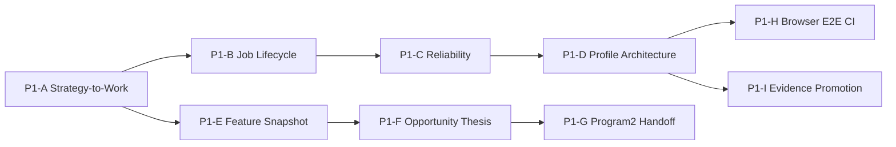

# Program 1 — Architecture Review and Implementation Plan

Status: APPROVED DOCUMENT-DRIVEN IMPLEMENTATION PLAN
Date: 2026-09-04
Scope: Program 1 only
Governing:
- `PROGRAM1_AFFILIATE_SUCCESS_STRATEGY.md`
- `PROGRAM1_SYSTEM_ARCHITECTURE.md`
- `PROGRAM1_UML_AND_RUNTIME_DIAGRAMS.md`

## 1. Review Team

This plan synthesizes the perspectives of:
- Affiliate / Marketing Strategy;
- Senior Software Architecture;
- Senior Python Engineering;
- Browser Automation;
- Data / Scraping Engineering;
- Data / Decision Science;
- Reliability / Distributed Systems;
- QA / Test Architecture;
- Process / SSOT Governance;
- Red Team / Failure Analysis.

## 2. Executive Review Conclusion

Program 1 should **not be rewritten**.

The existing foundation is directionally strong:
- Back Office authority;
- durable observation ingestion;
- worker registry/heartbeat;
- local outbox;
- ACK validation;
- fail-closed anti-bot classification;
- evidence-gated Shopee profiles;
- deterministic fixture tests;
- extension UI separation beginning to improve.

However, current implementation has outgrown its first laboratory shape.

The next maturity step is to convert Program 1 from:

```text
Side-panel-driven browser collector
```

into:

```text
Back-Office-controlled durable browser worker
+ modular evidence-gated collection profiles
+ explicit affiliate opportunity intelligence
```

## 3. Current-to-Target Gap Matrix

| Area | Current Evidence | Target | Priority |
|---|---|---|---|
| Business mission | Product discovery/intelligence foundation | Affiliate Opportunity Intelligence strategy-led | P0 docs complete |
| Long-running worker lifecycle | substantial auto-run behavior in Side Panel/process store | Shared Job + background worker owns durable lifecycle | P1 |
| UI | Status/settings/activity + orchestration behavior | projection + operator commands only | P1 |
| Job lease/pause/resume | specification exists | integrated in Program 1 runtime | P1 |
| Collection code | broad `content.js` responsibilities | router + versioned per-surface profiles | P1 |
| Profile evidence state | laboratory naming/evidence docs | explicit lifecycle metadata + registry | P1 |
| Outbox | durable queue + serial drain + strict ACK | structured failure classes + quarantine/reconciliation | P1 |
| ACK semantics | exact accepted-count expectation | durable-accounted-for semantics reviewed across replay/duplicate cases | P1 |
| MV3 restart | registration/outbox recovery partly implicit | canonical restart/rejoin/reconcile flow | P1 |
| Transport errors | mostly string/error-code style | structured retryable/permanent/ambiguous taxonomy | P1 |
| Opportunity features | framework/scoring foundation | versioned feature snapshot + unknown/evidence state | P1 |
| Opportunity decision | shortlist/score foundation | qualification + thesis + action + risk + optional score | P1 |
| Program 1 -> 2 | product candidate v1 | qualified opportunity candidate v1.1 | P1/P2 |
| Browser E2E | deterministic tool exists | CI-enforced deterministic worker E2E | P2 |
| Shopee field profiles | identity/name evidence strongest; fields still gated | per-surface production candidates after repeated evidence | P2 |
| Outcome learning | conceptual analytics loop | downstream attribution-driven model learning | later |

## 4. Architecture Finding A — Durable Job Authority

### Finding

The current extension UI/process store contains substantial auto-run coordination. This was appropriate for laboratory iteration but conflicts with the target rule that UI is not lifecycle SSOT.

### Target

```text
Operator/UI
   -> Back Office command
   -> Shared Job Engine
   -> leased Background Worker
   -> checkpoint/result
```

### Required change

Program 1 background worker becomes a Shared Job protocol participant:
- lease;
- renew;
- pause;
- resume;
- checkpoint;
- complete/fail/needs-human;
- safe restart/rejoin.

### Acceptance

Closing Side Panel must not invalidate a durable active job.

## 5. Architecture Finding B — Collection Profile Modularity

### Finding

Current `content.js` mixes:
- identity parsing;
- surface inference;
- product target search;
- product-name heuristics;
- pagination;
- anti-bot detection;
- fixture behavior;
- Shopee behavior;
- message execution.

### Target

```text
content entrypoint
  -> page classifier
  -> collection router
  -> selected versioned profile
  -> canonical observation facts
```

Suggested logical layout:

```text
src/collector/
  core/
    identity
    normalization
    pageClassification
    resultContract
  profiles/
    fixture/
    shopee/
      common
      search
      category
      shop
      productDetail
```

Exact filenames are implementation detail; responsibility split is governing.

### Acceptance

A new surface/profile can be introduced and tested without modifying unrelated profile extraction logic.

## 6. Architecture Finding C — Profile Evidence Lifecycle

Each profile should expose metadata:
- profile_id;
- version;
- surface;
- locale/context;
- evidence state;
- supported fields;
- required indicators;
- fixture version;
- last validated evidence reference.

A profile whose evidence becomes stale/schema-incompatible should fail closed or be quarantined rather than silently fallback.

## 7. Reliability Finding A — ACK Semantics

Current worker validation expects submitted observation count to equal accepted count.

Review must determine the canonical meaning for replay/duplicate cases.

Desired business invariant:

> Every submitted observation in an acknowledged batch is durably accounted for according to the versioned ingestion contract.

That may eventually distinguish:
- newly accepted;
- already accepted/duplicate;
- rejected;
- conflicting.

Do not change semantics until Back Office contract and tests are updated coherently.

## 8. Reliability Finding B — Poison Message / Head-of-Line Blocking

Current serial outbox behavior correctly stops on a delivery failure, but a permanently invalid first message can indefinitely block later valid work.

Design requirement:
- classify transient vs permanent vs ambiguous;
- preserve evidence;
- no silent data loss;
- introduce quarantine/reconciliation semantics;
- queue continuation policy must be explicit and tested.

## 9. Reliability Finding C — MV3 Restart

Chrome may terminate the extension service worker.

Target recovery:
1. restore durable local settings/outbox state;
2. re-register/heartbeat;
3. ask Back Office for canonical active job/lease state;
4. reconcile local execution state with durable checkpoint;
5. resume only safe work.

In-memory booleans are projections, not truth.

## 10. Reliability Finding D — Structured Errors

Program 1 worker/application errors should classify at least:
- VALIDATION;
- TRANSIENT_NETWORK;
- BACKEND_UNAVAILABLE;
- RATE_LIMIT / PRESSURE;
- SESSION_REQUIRED;
- PAGE_BLOCKED_BY_ANTIBOT;
- PAGE_UNSUPPORTED;
- SCHEMA_CHANGED;
- CONTRACT_MISMATCH;
- ACK_AMBIGUOUS;
- PERMANENT_PAYLOAD;
- NEEDS_HUMAN.

Stable codes and structured context are preferred over parsing strings.

## 11. Intelligence Finding A — Feature Layer

Do not jump directly from ProductObservation to opaque total score.

Implement:

```text
Observation History
 -> Opportunity Feature Snapshot
 -> Qualification
 -> Opportunity Decision
```

First feature implementation should use deterministic, testable synthetic/fake inputs.

No production Shopee-specific weight is required.

## 12. Intelligence Finding B — Opportunity Thesis

Every decision should eventually answer:
- Why now?
- What buyer/context?
- What evidence?
- What strengths?
- What content angles?
- What risks/unknowns?
- What action is recommended?
- What policy/version produced this?

This becomes a durable explainability primitive.

## 13. Intelligence Finding C — Recommended Action

Initial action vocabulary:

`TEST_NOW | WATCH | SCALE | HOLD | DEPRIORITIZE | STOP | NEEDS_EVIDENCE`

The exact allowed transitions are policy-versioned. Decision history should be append/version oriented rather than rewriting past reasoning.

## 14. Marketing / Affiliate Strategy Finding

Program 1 business-feature backlog must be organized by decision questions rather than fields.

Examples:

### Question: "Which products deserve testing now?"
Potential signals:
- current demand evidence;
- momentum;
- buyer-intent context;
- price/value;
- seller confidence;
- contentability;
- risk.

### Question: "Which watched products became timely?"
Potential signals:
- price/promotion change;
- demand/ranking movement;
- seasonal/campaign context;
- new evidence sufficiency.

### Question: "Which products should stop consuming effort?"
Potential signals:
- deteriorating opportunity evidence;
- poor downstream outcomes;
- stale/unavailable offer/product;
- saturation;
- rising risk.

Each signal still requires evidence and outcome validation.

## 15. Data Engineering Finding

Preserve:
- immutable observations;
- observed_at;
- source worker/profile;
- campaign/query/surface provenance;
- evidence refs;
- schema/profile version.

Maintain a current projection separately for efficient reads.

Historical records must support momentum/trend derivation without reconstructing overwritten states.

## 16. QA Strategy

### Unit
- identity/value normalization;
- feature derivation;
- qualification;
- ranking/action rules;
- structured error classification.

### Component
- discovery planning with fake worker port;
- ingestion/replay;
- opportunity evaluation;
- shortlist/handoff.

### Contract
- worker registration;
- lease;
- checkpoint;
- observation batch;
- ACK;
- Program 1 -> 2 v1.1.

### Fixture
- each collection profile;
- positive + negative + schema-drift cases.

### Integration
- SQLite;
- PostgreSQL compatibility later;
- migrations;
- restart.

### Resilience
- ACK loss;
- duplicate replay;
- poison message;
- worker crash;
- MV3 restart;
- lease expiry;
- pause/resume;
- stale result;
- backend outage.

### Deterministic Browser E2E
- real built extension;
- local fixture page(s);
- local/mock Back Office;
- lease -> collect -> enqueue -> submit -> ACK -> checkpoint -> complete.

### Live Evidence
- controlled human-authorized Shopee validation only.

## 17. Vertical Slice Roadmap

### Slice P1-A — Strategy-to-Work Contract
Goal:
Represent campaign hypothesis + required signals in application/domain contracts.

Deliver:
- business hypothesis reference;
- signal requirement reference;
- discovery plan contract;
- tests.

No Shopee code needed.

### Slice P1-B — Program 1 Job Lifecycle
Goal:
Move durable run authority to Shared Job Engine + background worker.

Deliver:
- lease/renew;
- pause/resume;
- checkpoint;
- completion;
- restart/rejoin;
- Side Panel becomes command/projection shell.

### Slice P1-C — Worker Reliability
Goal:
Make outbox/ACK semantics safe under replay/failure.

Deliver:
- structured error classification;
- ACK semantic contract;
- poison/quarantine design;
- lost ACK/restart tests.

### Slice P1-D — Collection Router/Profile Contract
Goal:
Separate collection responsibilities before adding more fields.

Deliver:
- router;
- profile metadata;
- fixture profile;
- Shopee lab profile adapters;
- compatibility tests.

### Slice P1-E — Opportunity Feature Snapshot
Goal:
Create versioned derived-feature architecture.

Deliver:
- domain model;
- application use case;
- repository port/in-memory implementation;
- deterministic feature tests;
- no production weight.

### Slice P1-F — Opportunity Decision / Thesis
Goal:
Produce explainable recommendation from feature snapshot.

Deliver:
- qualification;
- data sufficiency;
- action;
- thesis;
- risks;
- optional component scores.

### Slice P1-G — Program 1 -> Program 2 v1.1
Goal:
Emit qualified opportunity candidate.

Deliver:
- DTO/schema;
- idempotency/conflict tests;
- compatibility handling.

### Slice P1-H — Deterministic Browser E2E CI
Goal:
Prove the real extension/runtime collaboration without Shopee.

### Slice P1-I — Evidence-Gated Surface Promotion
Goal:
Promote only fields/profiles supported by repeated evidence.

## 18. Dependency Order



P1-E/F may proceed in parallel with browser worker work using fake observations.

## 19. Definition of Ready for Each Slice

Must identify:
- affiliate decision/hypothesis or foundation rationale;
- governing docs/diagram IDs;
- owner;
- inputs/outputs;
- durable state;
- error/failure classes;
- idempotency/concurrency;
- observability;
- tests;
- evidence gate;
- migration/config impact;
- rollback/recovery.

CRITICAL/HIGH design issue count must be zero.

## 20. Definition of Done

A slice is Done when:
- implementation matches diagrams/contracts;
- narrow tests pass;
- repository gates pass;
- relevant failure paths pass;
- docs/Kanban/verification updated;
- no unvalidated platform fact was promoted;
- CI evidence is recorded;
- source remains resumable from SSOT.

## 21. Red-Team Questions Required Before Merge

For relevant slices:
- What happens if the same batch is submitted ten times?
- What happens if DB commits but ACK disappears?
- Can one bad outbox message block the worker forever?
- What happens if the service worker restarts mid-job?
- Can Side Panel closure cancel/corrupt a durable job?
- Can a stale lease result overwrite current job state?
- Can schema drift appear as a legitimate empty result?
- Can unsupported/ambiguous profile selection execute anyway?
- Can missing evidence become zero/high score?
- Can a model/policy change reinterpret an in-flight decision?
- Can a worker make a commercial decision that belongs to Back Office?

## 22. Implementation Authorization

After this document baseline, source work is authorized only as small vertical slices following the dependency order and governing documents.

Do not implement all slices in one broad refactor.

The recommended first coding slice is **P1-A or P1-B**, with P1-A being lower-risk and P1-B providing the highest immediate runtime architecture value.
