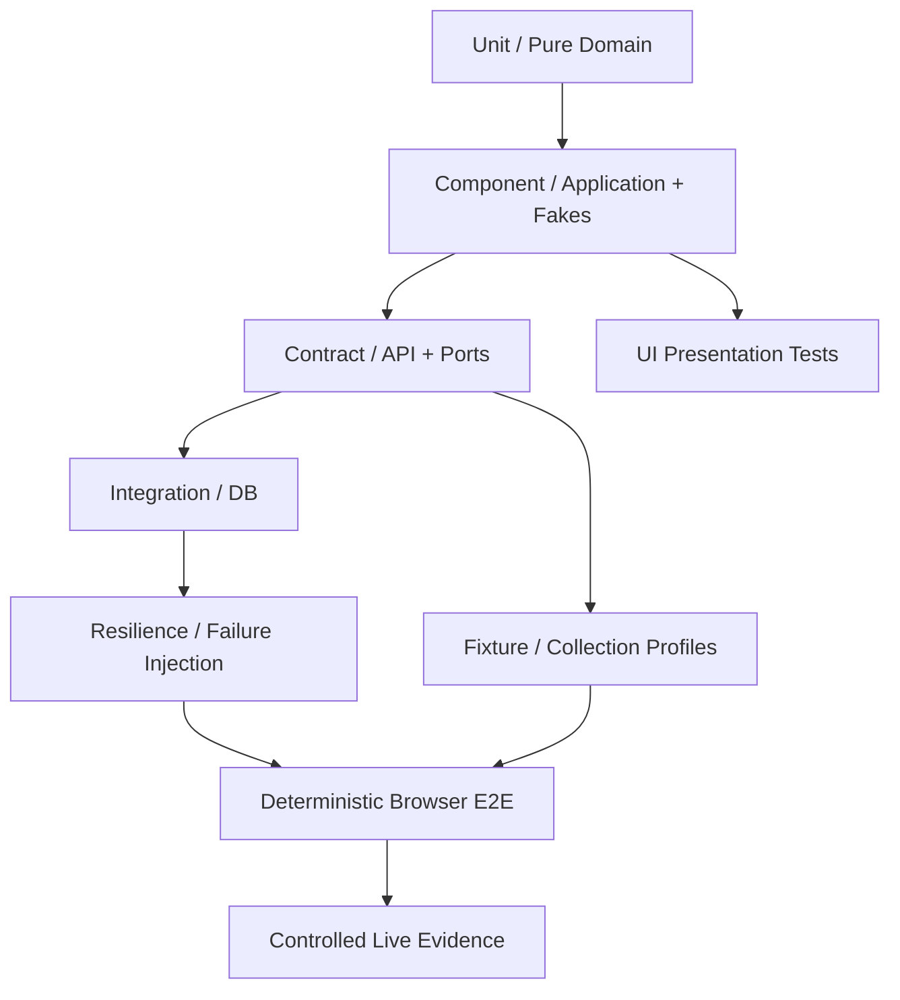

# Program 1 — Automated Test Architecture

Status: GOVERNING TEST DESIGN
Date: 2026-09-04

## 1. Objective

Program 1 must be highly testable without depending on graphical UI, live Shopee, or manual operator actions for core correctness.

Target:

> Most business, lifecycle, failure and integration behavior runs as deterministic automated tests in CI.

UI and live Shopee tests validate outer adapters and user experience, not the core business rules.

## 2. Test Architecture



## 3. Headless Core

Core tests must run with:
- no graphical UI;
- no browser;
- no external network;
- no physical device;
- deterministic clock/ID/random inputs where relevant.

Cover:
- hypothesis/signal/discovery-plan traceability;
- normalization;
- feature derivation;
- qualification;
- Opportunity Thesis;
- ranking;
- Program 1 -> 2 handoff;
- job lifecycle;
- ACK/idempotency/replay policy;
- structured error classification.

## 4. Fake Infrastructure

Required reusable fakes:
- ClockPort;
- ID generator;
- ProductRepository;
- OpportunityRepository;
- Shared Job Repository;
- Worker/Job transport;
- Collection result source;
- Program 2 handoff sink;
- telemetry/event sink.

Fakes should implement the same semantic contracts used by real adapters.

## 5. Deterministic Collection Profile Tests

Each profile requires sanitized fixtures for:
- supported happy path;
- missing optional fields;
- missing required indicators;
- empty validated page;
- anti-bot/verification;
- schema drift;
- malformed identity;
- pagination edge;
- duplicate cards/links;
- localization/text variance where applicable.

No production profile is promoted without fixture coverage plus required evidence.

## 6. Persistence Integration

SQLite tests must cover:
- migrations;
- observation append history;
- idempotent batch receipt;
- observation identity conflict;
- concurrent same batch;
- concurrent same observation;
- opportunity snapshot/decision persistence when implemented;
- transaction rollback.

PostgreSQL parity remains a Tier-1 compatibility goal.

## 7. Resilience Matrix

Mandatory Program 1 scenarios:

| Failure | Expected behavior |
|---|---|
| ACK lost after commit | replay returns reproducible ACK |
| same batch replayed | no duplicate durable facts |
| batch ID reused with different payload | conflict |
| poison outbox message | quarantine/reconcile; no silent loss |
| backend unavailable | retain outbox; retry bounded |
| service worker killed | re-register/reconcile from canonical state |
| lease expires | stale result rejected; safe reassignment only |
| UI closes | durable job unaffected |
| anti-bot page | fail closed / pause |
| schema changed | explicit SCHEMA_CHANGED, not empty success |
| zero observations valid page | SUCCESS_EMPTY_VALIDATED |
| missing feature evidence | NEEDS_EVIDENCE |
| policy changes mid-job | running work retains captured version semantics |

## 8. Deterministic Browser E2E

Governing implementation detail: `PROGRAM1_CHROMIUM_E2E_AND_RESTART_SPEC.md`.

Goal:
Test the real built extension and runtime collaboration without Shopee.

Harness:

```text
Build extension
 -> Start local fixture server
 -> Start local/mock Back Office
 -> Launch Chromium/Brave with extension
 -> Register worker
 -> Lease job
 -> Navigate fixture page
 -> Collect
 -> Persist local outbox
 -> Submit
 -> ACK
 -> Checkpoint
 -> Page advance
 -> Complete
 -> Assert DB/mock state
```

The harness runs unattended in CI as a dedicated `program1-browser-e2e` job using real Playwright Chromium under Xvfb. It must prove persistent-profile restart/reconcile and must not depend on the Side Panel for correctness.

## 9. UI Automation Policy

Do not use UI automation to prove core business correctness already testable below the UI.

UI tests should verify:
- setup flow;
- command dispatch;
- read-model rendering;
- state mapping;
- reconnect;
- error guidance;
- accessibility.

Prefer component/view-model tests over pixel-based automation.

## 10. Live Shopee Evidence Tests

These are controlled laboratory/evidence activities, not ordinary CI.

Use only to validate:
- surface structure;
- selector/profile assumptions;
- identity;
- field boundaries;
- pacing behavior;
- anti-bot classification;
- browser compatibility.

No bypass of controls.

## 11. CI Stages

Recommended Program 1 CI:

```text
Stage 1: lint/static/architecture
Stage 2: unit
Stage 3: component
Stage 4: contract
Stage 5: SQLite integration
Stage 6: resilience
Stage 7: extension build + node tests
Stage 8: deterministic browser E2E
Stage 9: optional scheduled PostgreSQL compatibility
```

Fail fast on early deterministic stages.

## 12. Test Data Policy

Fixtures:
- sanitized;
- deterministic;
- committed when safe;
- versioned with profile;
- no cookies/tokens/account secrets;
- no unnecessary private/raw user data.

Generated random fixtures should use deterministic seeds when reproducibility matters.

## 13. Test Speed Policy

Maintain a fast developer loop:
- unit/component/contract tests in seconds;
- integration/resilience scoped by marker;
- browser E2E selective;
- live evidence separate.

Developers should be able to test a slice without launching the UI manually.

## 14. Definition of Done — Automation

A Program 1 feature is not Done when:
- its only test is manual UI clicking;
- failure behavior is untested;
- external dependencies cannot be replaced by fakes where appropriate;
- a regression cannot be reproduced deterministically without documented reason;
- CI does not cover the new critical contract/state path.

## 15. Long-Term Target

Program 1 should support a one-command or CI-triggered validation workflow that proves the complete strategy-to-opportunity path using deterministic fakes/fixtures, with live Shopee used only for adapter evidence validation.
