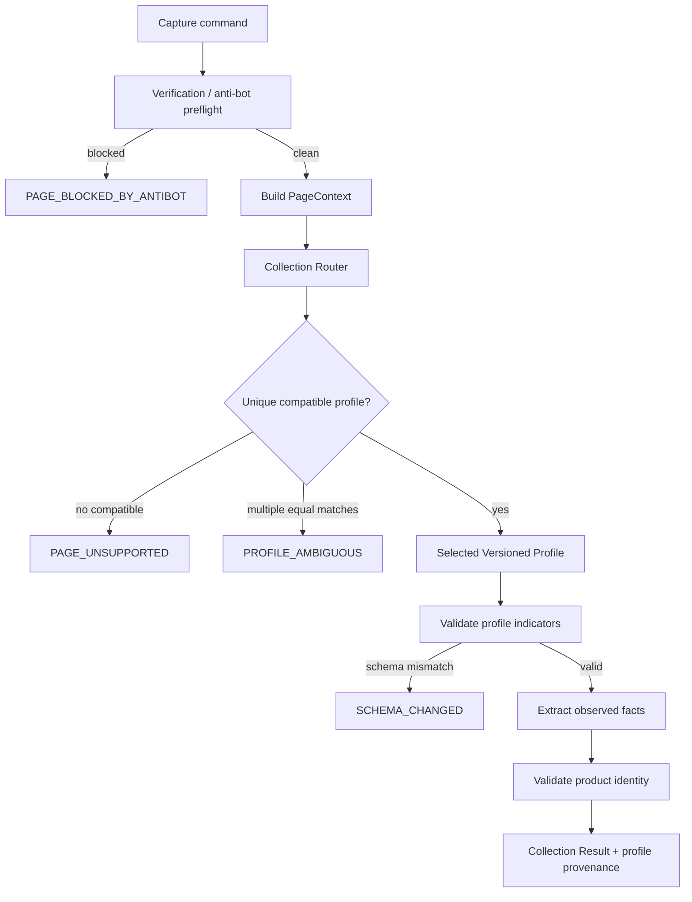

# Program 1 — Collection Router and Versioned Profile Registry

Status: GOVERNING IMPLEMENTATION DESIGN
Date: 2026-09-05
Card: P1-D
Scope: Browser Worker collection adapter architecture only

## Objective

Replace the monolithic Shopee current-page parser with explicit, versioned, evidence-gated collection profiles selected by a deterministic router.

The router/profile layer is an adapter boundary. It may observe page facts, but it must not own opportunity qualification, ranking, commercial policy or job lifecycle.

## Canonical runtime flow



## Required profile metadata

Every registered profile declares:

- `profile_id` — stable semantic identifier;
- `version` — profile contract/parser version;
- `platform`;
- `locale`;
- `surface` — fixture/search/category/shop/product_detail;
- `evidence_stage` — EXPERIMENTAL/LAB_VALIDATED/EVIDENCE_VALIDATED/PRODUCTION_CANDIDATE/PRODUCTION_APPROVED/STALE/DEPRECATED;
- `priority` — deterministic tie-break only among otherwise compatible profile families, never a substitute for evidence;
- `required_indicators` — evidence-backed page facts needed before extraction;
- `optional_indicators`;
- `extracted_fields`;
- `unknown_fields` — fields deliberately left null rather than guessed;
- `compatibility_scope`;
- `evidence_refs`;
- `fixture_refs`;
- `failure_modes`.

## Router contract

Input:
- normalized PageContext;
- available registry entries;
- optional required capability/profile constraint from DiscoveryPlan.

Output:
- `SELECTED(profile_ref)`;
- `PAGE_UNSUPPORTED`;
- `PROFILE_AMBIGUOUS`;
- `PROFILE_NOT_ALLOWED_BY_EVIDENCE_STAGE`;
- `SCHEMA_CHANGED` when the selected profile family is recognized but required indicators are absent.

Rules:
1. anti-bot/verification classification executes before normal routing;
2. no fallback from an unsupported surface to a generic parser that guesses;
3. production execution may require a minimum evidence stage supplied by policy;
4. laboratory/manual capture may explicitly allow LAB_VALIDATED profiles;
5. selection must be deterministic and independently unit-testable;
6. result always carries profile id/version/evidence stage;
7. a profile never silently expands its supported surface.

## Initial registry baseline

| Profile | Surface | Stage | Role |
|---|---|---|---|
| `fixture-profile-v1` | fixture | LAB_VALIDATED | deterministic test fixture extraction |
| `shopee-search-lab-v1` | search | LAB_VALIDATED | evidence-backed identity/name only; price/sold remain unknown |
| `shopee-category-lab-v1` | category | LAB_VALIDATED | evidence-backed identity/name only |
| `shopee-shop-lab-v1` | shop | LAB_VALIDATED | evidence-backed identity/name only |
| `shopee-pdp-lab-v1` | product_detail | LAB_VALIDATED | URL identity + PDP title only |

These profiles are laboratory/evidence-gated. Their existence does not mean PRODUCTION_APPROVED.

## Code ownership target

```text
src/
  collectors/
    core.js
    router.js
    profiles/
      fixture.js
      shopee_common.js
      shopee_search_lab_v1.js
      shopee_category_lab_v1.js
      shopee_shop_lab_v1.js
      shopee_pdp_lab_v1.js
  content.js        # bootstrap/message bridge only
```

`background.js` injects these classic scripts in dependency order. Modules expose a single namespaced registry on `globalThis`; they must not create independent durable state.

## Result provenance

Every successful or failed profile result should expose at minimum:
- `profile_id`;
- `profile_version`;
- `profile_evidence_stage`;
- `surface`;
- `page_url`;
- `page_classification`;
- `observations`;
- `pagination` when applicable;
- `page_context`/schema indicators;
- explicit `error` when not successful.

## Test requirements

Required automated tests:
- router chooses exactly one compatible profile;
- unsupported surface fails closed;
- ambiguous profile match fails closed;
- minimum evidence-stage policy blocks weaker profiles;
- each profile has sanitized fixture coverage;
- identity parsing remains shared and deterministic;
- anti-bot state preempts routing;
- search/category/shop/PDP do not cross-match one another;
- result contains profile provenance;
- existing Program 1 background/transport/job tests remain green.

## Promotion rule

Profile metadata may move forward only under `CONTROLLED_PRODUCTION_EVIDENCE_VALIDATION_STANDARD.md` and `PRODUCTION_EVIDENCE_PROMOTION_MATRIX.md`.

Router implementation and profile modularity can be production-quality while individual Shopee profile evidence stages remain laboratory-only.

## Definition of Done — P1-D

- governing docs and diagrams updated;
- content parser responsibilities split into router/core/profile modules;
- no business policy moved into browser adapter;
- all previous parser behavior intentionally preserved or made more fail-closed;
- profile registry metadata visible/testable;
- extension version/README updated;
- extension, conformance, core, SQLite and stress CI green;
- CAPA recorded for any defect found during verification.