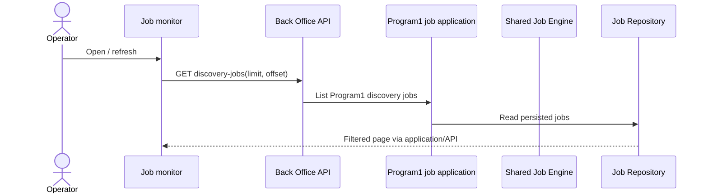

# Program 1 operator job monitor

Date: 2026-09-14. Card: P1-UI-JOBS. Foundation usability slice under P1-B and PROGRAM1_UX_AND_OPERATOR_EXPERIENCE.md. CRITICAL/HIGH design issues: 0 for read-only monitoring. Operator pause remains design-blocked by the discrepancy below.

Back Office owns canonical job state. The operator must see what work is waiting, executing, paused or failed and inspect its last durable checkpoint without Swagger. This slice exposes existing discovery jobs, not a new lifecycle or strategy preset.

GET /api/v1/program1/discovery-jobs accepts limit 1..100 (default 20), offset >=0; returns items, total, limit, offset. Filter domain=program1 and type=DISCOVER_PRODUCTS before count/page, order created_at descending then job_id descending. Operator list omits lease_token. Application uses the existing JobRepository port; current list-all implementation is a documented scalability limitation.

The daisyUI monitor displays state in Thai, last update, assigned worker, failure details and checkpoint under expandable diagnostics. It never calls a completed job a newly discovered product or a delivered observation count. Reload reads persisted server state; no local lifecycle storage. Error and empty states are distinct.

Read-only scope: no pause/resume mutations are exposed. The existing engine immediately revokes a lease when paused, whereas specs/JOB_LEASE_PAUSE_RESUME_SPEC.md section 7.2 requires a cooperative safe-unit checkpoint before pause. Resolve and regression-test this discrepancy before enabling operator controls. Existing PAUSED is displayed as a recorded server state, not a guarantee that an in-flight page was captured.

Tests: isolated Program1/type filter, stable page/count, invalid bounds, no lease-token exposure; UI read transport failure handling and Thai status/recovery mapping. Existing engine/SQLite tests cover atomic pause/resume and restart. Run shared pipeline gates and visible Brave readback. Job creation UX and production Shopee acceptance remain separate required work.

