# Program 1 — Affiliate Opportunity Intelligence System Architecture

Status: GOVERNING DESIGN BASELINE
Date: 2026-09-04
Scope: Program 1 only
Governing strategy: `PROGRAM1_AFFILIATE_SUCCESS_STRATEGY.md`
Method: DOCUMENT-FIRST / STRATEGY-LED / ENGINE-FIRST / EVIDENCE-FIRST

## 1. Design Objective

Program 1 turns affiliate/marketing strategy into evidence-backed product opportunity decisions.

The system must answer:

> Which product opportunities should we pursue next to maximize expected affiliate success per unit of effort, and why?

The architecture is therefore optimized for:
- decision quality;
- explainability;
- historical evidence;
- bounded/recoverable collection;
- replaceable source adapters;
- traceability from strategy to outcome;
- safe evolution as Shopee surfaces change.

It is not optimized for maximum scraping throughput.

## 2. Governing Architecture Principles

1. Affiliate/Marketing Strategy defines the business hypothesis and required signals.
2. Browser workers collect bounded facts; they do not own opportunity policy.
3. Back Office owns durable job lifecycle and commercial decisions.
4. Observed facts, normalized facts, derived features and decisions are separate layers.
5. Historical observations are append-oriented.
6. Unknown/ambiguous evidence remains unknown/ambiguous.
7. Collection profiles are versioned, evidence-gated adapters.
8. UI is an operator shell, not a durable workflow authority.
9. Long-running work uses Shared Job lease/checkpoint semantics.
10. Worker-to-Back-Office delivery is durable/idempotent.
11. Anti-bot/access-control states fail closed; no bypass behavior.
12. Production scoring weights are not invented before downstream evidence exists.
13. Every business-feature slice must trace to an affiliate decision/hypothesis.
14. Every critical component must support deterministic fake-driven testing.

## 3. System Context

Program 1 collaborates with five external actor/system categories:

- Affiliate/Marketing Strategist — defines success hypothesis and campaign context.
- Operator — supervises campaigns/workers and reviews opportunities.
- Shopee Web / approved product sources — evidence source.
- Program 2 — consumer of qualified opportunity candidates.
- Future Analytics/Attribution — provides downstream outcomes for learning.

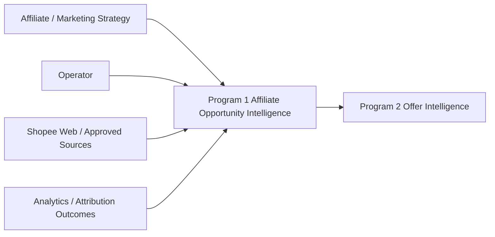

## 4. Strategic Control Loop

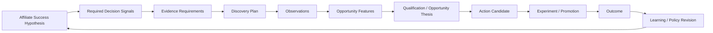

Key rule: no direct arrow from raw scraped data to business decision.

## 5. Logical Component Architecture

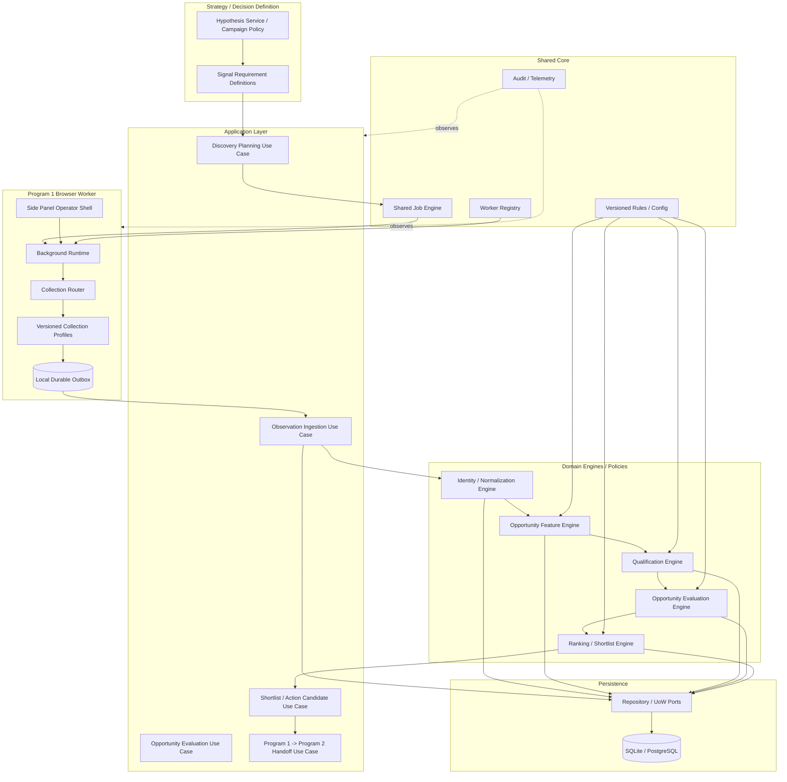

## 6. Responsibility Boundaries

### 6.1 Affiliate / Marketing Strategy

Owns:
- target business outcome;
- audience/context assumptions;
- campaign/season hypotheses;
- definition of useful signals;
- definition of test/watch/scale/stop questions.

Must not own:
- DOM selectors;
- worker retry implementation;
- persistence transaction behavior.

### 6.2 Discovery Planning Application

Owns:
- translate approved business hypothesis into bounded discovery work;
- required signal/profile capability;
- job scope;
- evidence sufficiency requirements;
- campaign/policy references.

Must not:
- scrape directly;
- embed selector logic;
- bypass Shared Job lifecycle.

### 6.3 Shared Job Engine

Owns:
- job creation;
- lease;
- renew;
- pause/resume/cancel lifecycle;
- attempt/version;
- checkpoint authority;
- safe reassignment.

This is the single durable lifecycle authority for long-running Program 1 work.

### 6.4 Browser Worker Background Runtime

Owns:
- registration/heartbeat;
- lease execution;
- bounded browser navigation/execution;
- collection profile selection through router;
- local durable outbox;
- checkpoints/results;
- local process health.

Must not own:
- product qualification;
- opportunity score;
- contentability policy;
- campaign commercial decision.

### 6.5 Side Panel

Owns:
- status display;
- configuration display/edit where authorized;
- operator commands such as start/pause/resume/stop;
- activity/error visibility.

Must not own:
- durable job state;
- retry policy authority;
- long-running auto-run state machine;
- commercial decision logic.

### 6.6 Collection Router

Input:
- target page/context;
- job required capabilities;
- available profile registry.

Output:
- selected profile or explicit unsupported/ambiguous result.

Rule:
- profile selection is evidence/version aware;
- no silent fallback from unsupported to guessed parser.

### 6.7 Collection Profiles

Each profile owns:
- supported surface definition;
- evidence status/version;
- selectors/parsing local to that surface;
- observed fact extraction;
- page/pagination interpretation for that profile.

Each profile must declare:
- profile_id/version;
- platform/locale/surface;
- evidence lifecycle state;
- required/optional indicators;
- extracted fields;
- unknown semantics;
- fixture set;
- schema-drift failure behavior.

### 6.8 Observation Ingestion

Owns:
- validate batch contract;
- durable idempotent ingestion;
- atomic receipt/ACK state;
- rejected/accepted classification;
- source provenance.

No ACK before durable state required to reproduce that ACK exists.

### 6.9 Identity / Normalization

Owns:
- canonical candidate identity abstraction;
- normalized text/value fields;
- unknown/null semantics;
- dedupe semantics;
- historical projection update.

Must not destroy raw/history evidence required for later explanation.

### 6.10 Opportunity Feature Engine

Owns derived features, for example:
- demand;
- momentum/timing;
- buyer-intent context;
- price/value;
- seller-confidence;
- competition/saturation;
- contentability;
- risk/uncertainty.

Must record:
- feature policy/schema version;
- source evidence references;
- reference time;
- unknown/data-sufficiency state.

### 6.11 Qualification / Opportunity Evaluation

Owns:
- eligibility to proceed;
- evidence sufficiency;
- Opportunity Thesis;
- risks/uncertainties;
- recommended action;
- optional score/component score when an approved model exists.

Output must be explainable.

### 6.12 Ranking / Shortlist

Owns:
- campaign-context ordering;
- shortlist/action-candidate selection;
- tie-breaking under versioned policy;
- selection reasons.

No worker/UI may override this authority outside explicit human-override workflow.

## 7. Program 1 Domain Model

Conceptual entities/value objects:

- Campaign / AffiliateSuccessHypothesis
- SignalRequirement
- DiscoveryJob / DiscoveryScope
- ProductObservation
- ProductIdentity
- ProductHistory / Projection
- OpportunityFeatureSnapshot
- OpportunityDecision
- OpportunityThesis
- ShortlistEntry / ActionCandidate
- EvidenceReference
- CollectionProfileReference
- PolicyVersion / ModelVersion

Conceptual relationships:

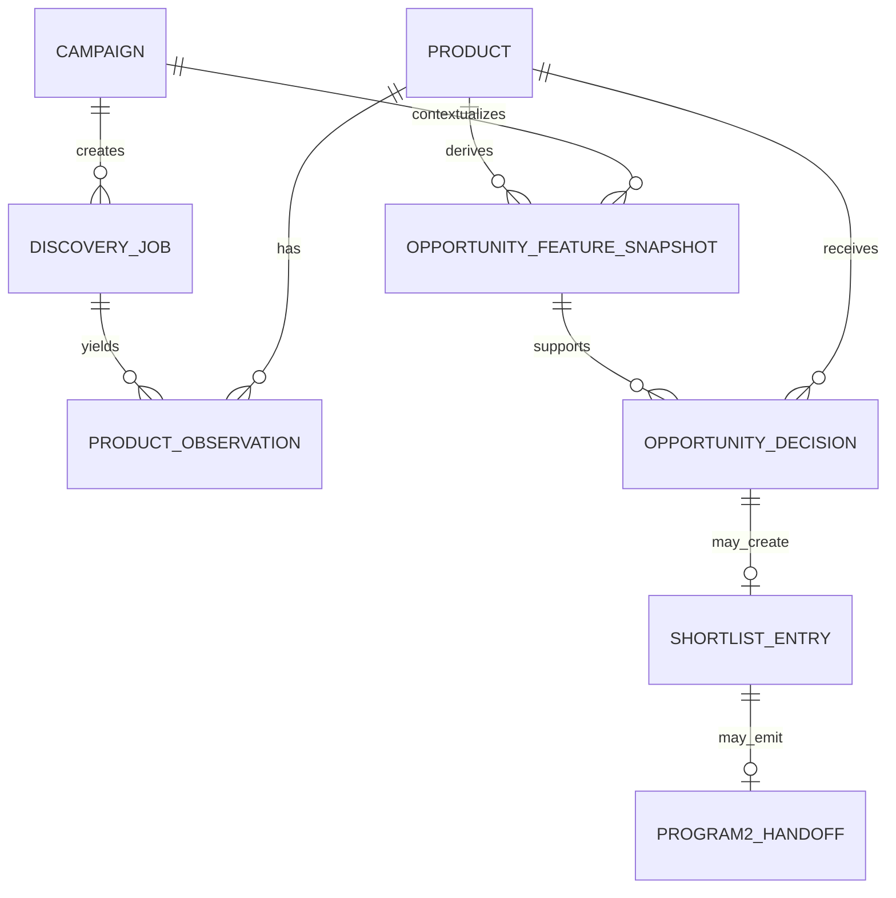

## 8. Canonical Data Lineage

```mermaid
flowchart LR
    RAW[Observed Raw Fact / Evidence Ref]
      --> OBS[ProductObservation]
      --> NORM[Normalized Fact]
      --> HIST[Historical Series / Projection]
      --> FEAT[Opportunity Feature Snapshot]
      --> DEC[Opportunity Decision / Thesis]
      --> SL[Shortlist / Action Candidate]
      --> H[Program 2 Handoff]
      --> OUT[Downstream Outcome]
      --> LEARN[Learning / New Policy Version]
```

Every downstream decision must be traceable backward to source evidence + policy/model version.

## 9. Discovery Job Contract

A Program 1 discovery job should conceptually include:

- job_id;
- campaign_id;
- hypothesis_id/reference;
- required_signals[];
- source/surface scope;
- keyword/category/shop/current-page scope;
- collection_profile_requirement;
- evidence/freshness policy;
- page/observation budget policy;
- pacing policy reference;
- checkpoint policy;
- capability requirements;
- idempotency identity;
- policy/config versions.

Numeric pacing limits remain evidence/config gated.

## 10. Collection Result Contract

Conceptual result:

- job_id / lease identity;
- profile_id/version;
- page/surface context;
- observations[];
- pagination/navigation facts;
- page classification;
- evidence/schema status;
- collection timestamp;
- worker/source provenance;
- error/health facts;
- checkpoint.

Result classifications should distinguish:
- SUCCESS_WITH_OBSERVATIONS;
- SUCCESS_EMPTY_VALIDATED;
- PAGE_UNSUPPORTED;
- PAGE_BLOCKED_BY_ANTIBOT;
- SCHEMA_CHANGED;
- SESSION_REQUIRED;
- TRANSIENT_NAVIGATION_FAILURE;
- PARTIAL_OBSERVATION;
- NEEDS_HUMAN.

Zero observations alone must never imply success.

## 11. Worker Runtime State Machine

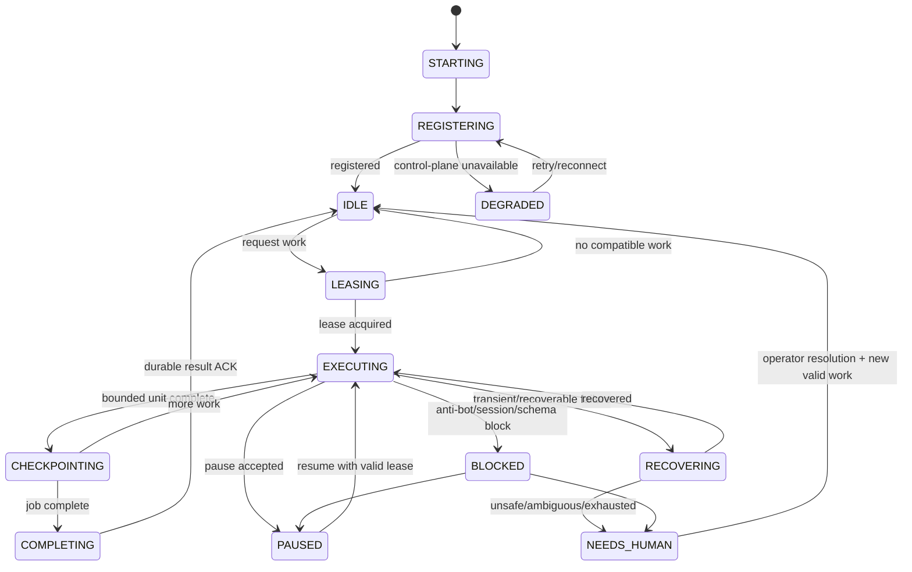

Side Panel state must project this runtime, not duplicate it.

## 12. Job State Machine

Shared Job Engine remains authoritative:

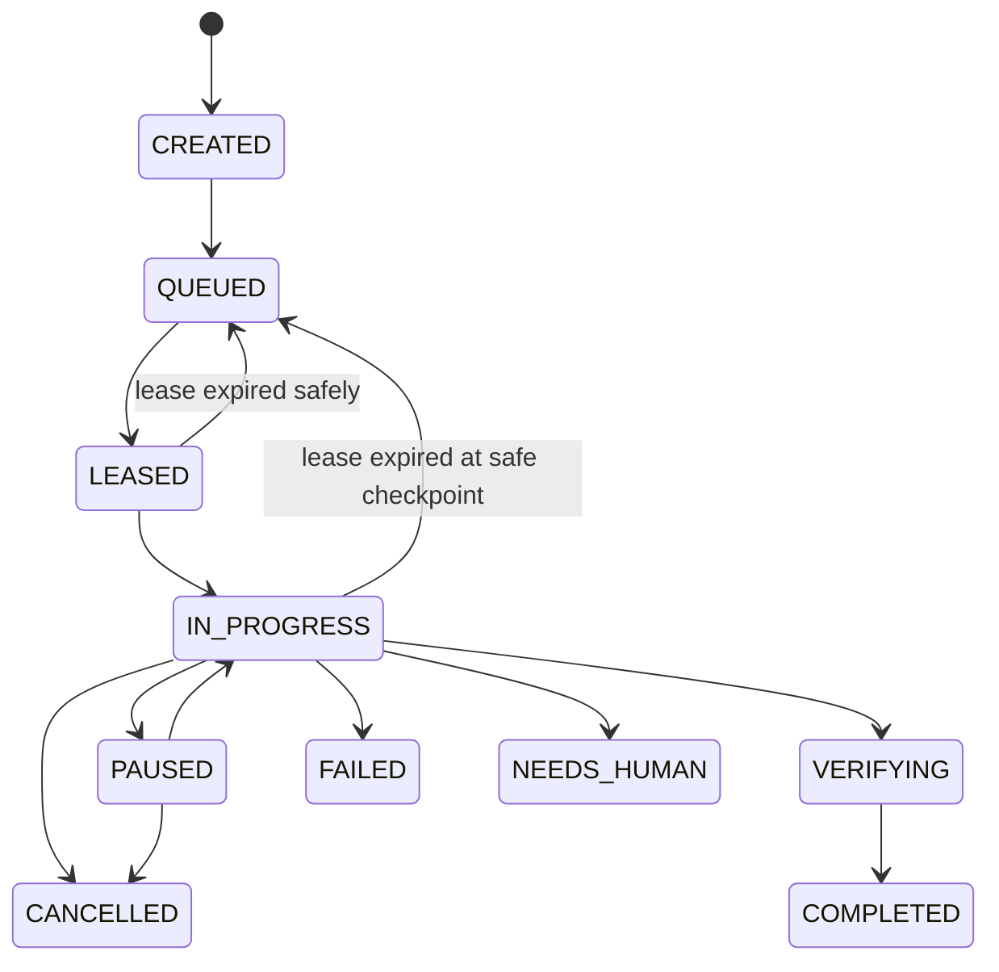

Reassignment is allowed only when the last durable checkpoint and external side-effect history make replay safe.

## 13. Observation Delivery Reliability

Delivery model:

```text
collect
 -> local durable enqueue
 -> send same batch/idempotency
 -> Back Office validate
 -> atomic business data + receipt state
 -> durable ACK
 -> local remove/mark delivered
```

Failure classes:

### Transient
Examples:
- network unavailable;
- HTTP 5xx;
- temporary backend unavailable.

Action:
- retain outbox;
- bounded retry/backoff;
- worker health may become DEGRADED/PRESSURED.

### Permanent Payload/Contract
Examples:
- invalid schema;
- unsupported profile version;
- impossible field contract.

Action:
- do not endlessly block queue;
- quarantine message/evidence;
- surface structured reason;
- continue only according to approved queue policy.

### Ambiguous ACK/Contract
Examples:
- ACK mismatches batch identity/count/accounted state.

Action:
- retain local evidence;
- reconciliation/operator review;
- never blindly discard.

The detailed quarantine semantics require an implementation slice/contract review before coding.

## 14. Opportunity Feature Architecture

Features are derived by policy/version, not stored as unversioned mutable truth.

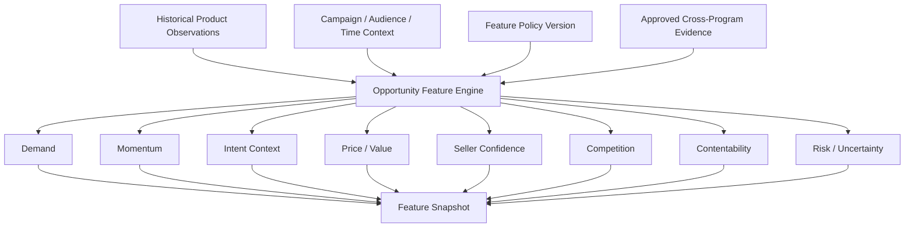

## 15. Opportunity Decision Architecture

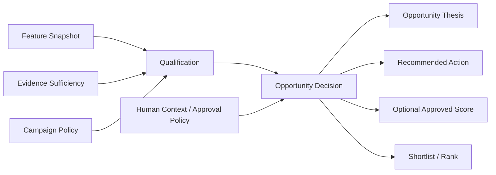

Recommended action is allowed to be `NEEDS_EVIDENCE`; uncertainty is a valid output.

## 16. Strategy-to-Signal Traceability

Every signal requirement should record:

- signal_id;
- business hypothesis/reference;
- affiliate decision supported;
- expected direction/interpretation;
- evidence source;
- normalization/feature use;
- freshness requirement;
- validation status;
- owner;
- downstream outcome used to evaluate usefulness.

This prevents "collect because available" behavior.

## 17. Runtime Deployment

### Portable Mode

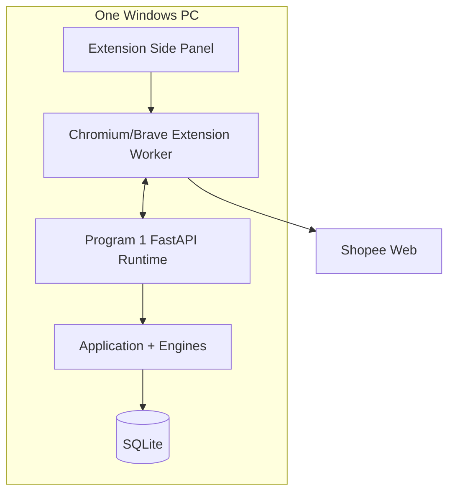

### Farm Mode

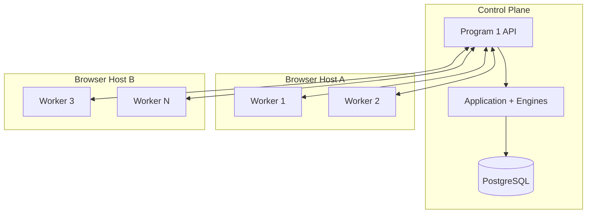

Farm scaling must not change domain/application contracts.

## 18. Observability Model

Program 1 should emit/measure:

### Business
- observations by campaign/surface/profile;
- qualified candidates;
- recommendation action counts;
- evidence sufficiency distribution;
- shortlist precision proxy;
- later candidate hit rate / revenue yield.

### Worker
- job lease age;
- page cycle duration;
- outbox depth/oldest age;
- delivery failures by class;
- anti-bot/session/schema blocks;
- recovery count;
- profile/version;
- heartbeat age.

### Data Quality
- identity parse rate;
- unknown field rate;
- duplicate rate;
- schema-drift rate;
- stale evidence rate;
- feature data sufficiency.

Raw throughput must not be promoted to the business North Star.

## 19. Security / Compliance Boundary

Program 1 must:
- avoid storing cookies/session secrets in ordinary evidence/domain records;
- use explicit operator-controlled authorization for Shopee access;
- fail closed on verification/anti-bot pages;
- not implement CAPTCHA/access-control bypass;
- not treat rate-limit pressure as a cue to become more aggressive;
- retain sanitized fixtures/evidence according to project policy.

## 20. Testing Architecture

```mermaid
flowchart LR
  H[Hypothesis / Signal Rule]
    --> U[Unit: feature/qualification]
    --> C[Component: application + fake ports]
    --> K[Contract: worker/API/profile]
    --> F[Fixture: parser/profile]
    --> I[Integration: SQLite/PostgreSQL]
    --> R[Resilience: ACK/restart/lease]
    --> E[E2E: deterministic browser fixture]
    --> L[Controlled Live Evidence]
```

Required negative tests include:
- no observations but validated empty;
- no observations due schema drift;
- anti-bot page;
- unsupported surface;
- duplicate batch replay;
- ACK lost after commit;
- poison/invalid queued message;
- service worker restart;
- lease expiry;
- pause/resume;
- stale checkpoint result;
- feature input missing;
- insufficient evidence -> NEEDS_EVIDENCE;
- policy version change while job/decision is in flight.

## 21. Implementation Decomposition

Recommended vertical slices:

### P1-A — Job Lifecycle Authority
- Shared Job lease/pause/resume for Program 1;
- move durable auto-run authority out of Side Panel;
- restart/checkpoint tests.

### P1-C — Worker Delivery Reliability
- structured error taxonomy;
- ACK/accounted-for semantics;
- quarantine/reconciliation contract;
- outbox head-of-line behavior tests.

### P1-D — Collection Profile Architecture
Governing implementation detail: `PROGRAM1_COLLECTION_ROUTER_AND_PROFILE_REGISTRY.md`.

- router interface;
- profile metadata/evidence lifecycle;
- split fixture and Shopee laboratory profiles;
- no production promotion without evidence.

### P1-E — Opportunity Feature Foundation
- feature snapshot domain/application contracts;
- evidence/data-sufficiency state;
- deterministic fake feature rules.

### P1-F — Opportunity Decision / Thesis
- qualification;
- recommendation action;
- risks/uncertainty;
- explanation/provenance;
- no invented production weights.

### P1-G — Program 2 Handoff v1.1
- qualified opportunity payload;
- contract tests;
- idempotency/conflict compatibility.

### P1-H — Deterministic Browser E2E CI
- build extension;
- start mock/local Back Office;
- load extension;
- deterministic fixture pages;
- lease/capture/outbox/ACK/checkpoint/complete flow.

## 22. Architecture Exit Criteria

Program 1 implementation may claim conformance to this design when:
- long-running worker lifecycle is Back-Office/Shared-Job controlled;
- Side Panel is projection/command shell only;
- collection profiles are modular/versioned;
- durable observation delivery handles replay/restart correctly;
- opportunity features are separate from observations;
- opportunity decisions are explainable/versioned;
- Program 2 receives qualified opportunity candidates;
- all critical flows have deterministic tests;
- no unvalidated Shopee facts have been promoted to production policy.

## 23. Open Evidence / Design Gates

Still open:
- exact production Product identity semantics;
- production per-surface selector profiles;
- price/sold/rating/review/seller boundaries;
- safe pacing/scroll/page budgets;
- feature schema finalization;
- production opportunity scoring weights;
- account/audience-fit data source;
- downstream attribution required to validate candidate quality.

These gates must remain explicit. They are not permission to guess.
