# Program 1 — UML and Runtime Diagram Pack

Status: GOVERNING DESIGN SUPPORT
Date: 2026-09-09
Governing architecture: `PROGRAM1_SYSTEM_ARCHITECTURE.md`

This pack exists to reduce implementation ambiguity. Diagrams describe responsibility, collaboration, state and failure boundaries. Concrete selectors and browser-specific internals remain adapter-local.

## D1 — Business Use Case View

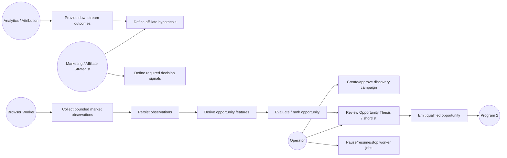

## D2 — Strategy-to-Implementation Activity Diagram

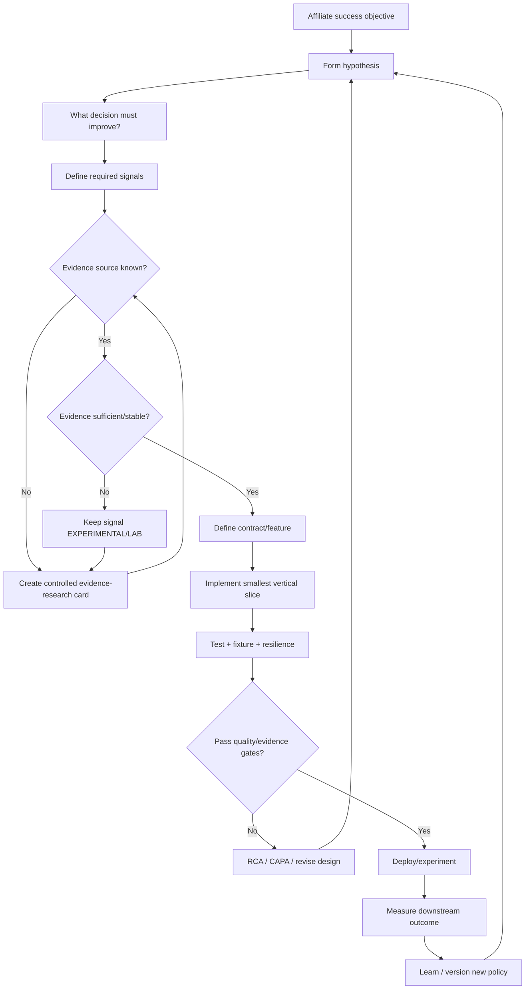

## D3 — Program 1 Component Diagram

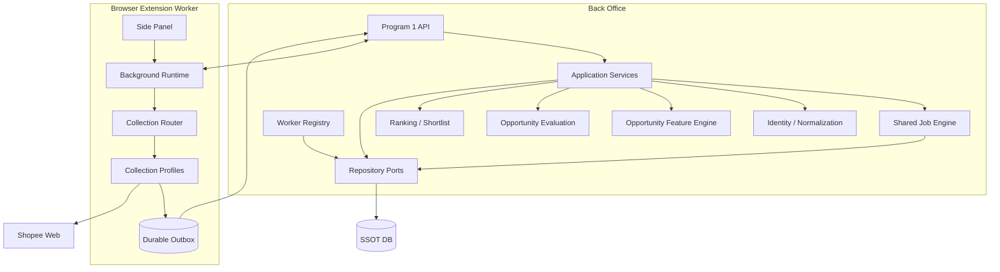

## D4 — Discovery Job Happy-Path Sequence (Target Composition)

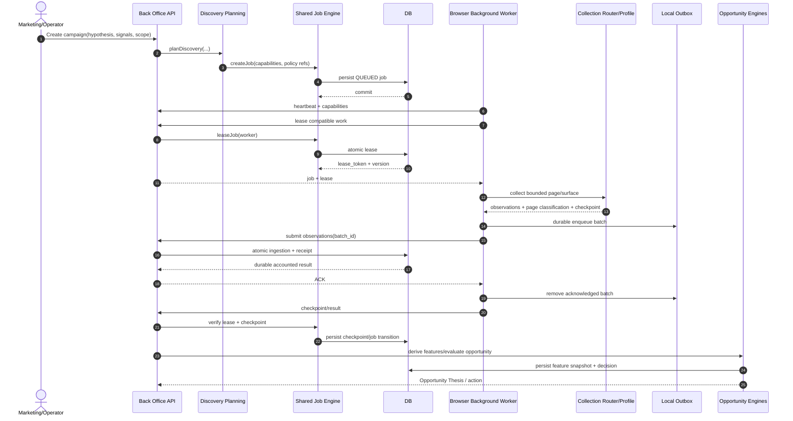

## D5 — ACK Loss / Idempotent Replay

```mermaid
sequenceDiagram
  autonumber
  participant BW as Browser Worker
  participant OUT as Outbox
  participant API as Back Office
  participant DB as DB

  BW->>OUT: enqueue B-101
  BW->>API: submit B-101
  API->>DB: atomic observations + receipt
  DB-->>API: COMMIT
  API--xBW: ACK lost

  Note over BW,OUT: retain B-101

  BW->>API: replay same B-101
  API->>DB: lookup durable receipt/idempotency
  DB-->>API: same accounted result
  API-->>BW: reproducible ACK
  BW->>BW: validate version + accepted/duplicate/accounted counts
  BW->>OUT: persist last receipt + remove B-101 in one serialized update
  Note over BW,OUT: Panel projects last receipt; checkpoint uses this batch only
```

## D6 — Poison Message / Quarantine Decision

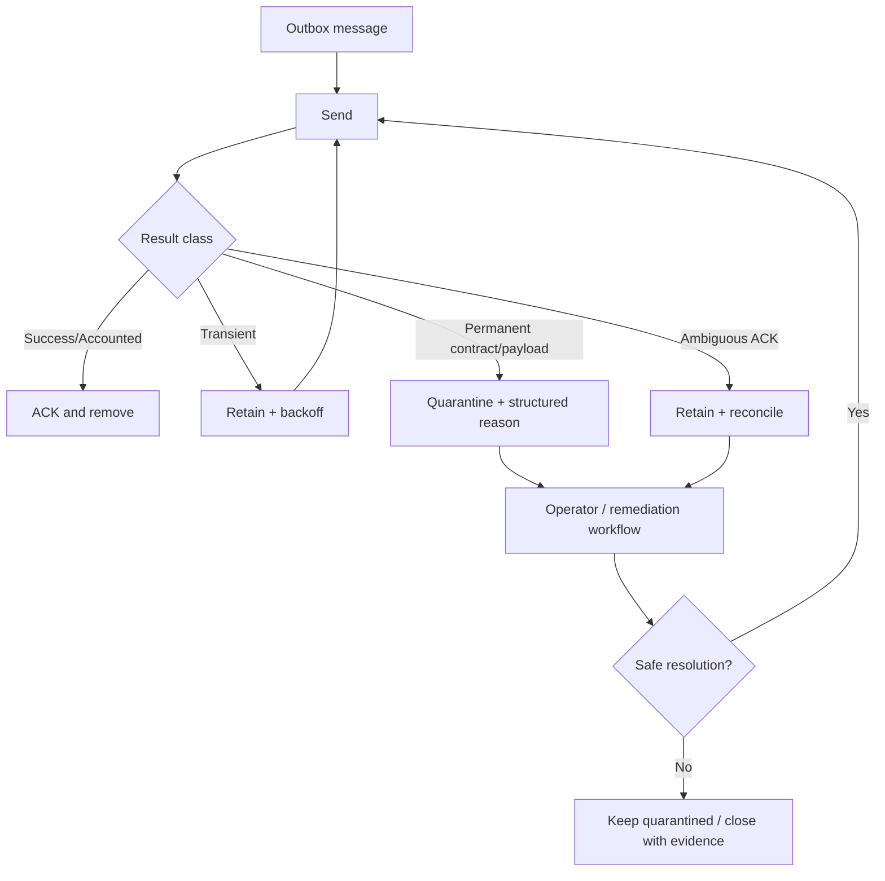

## D7 — Anti-bot / Schema Change Flow

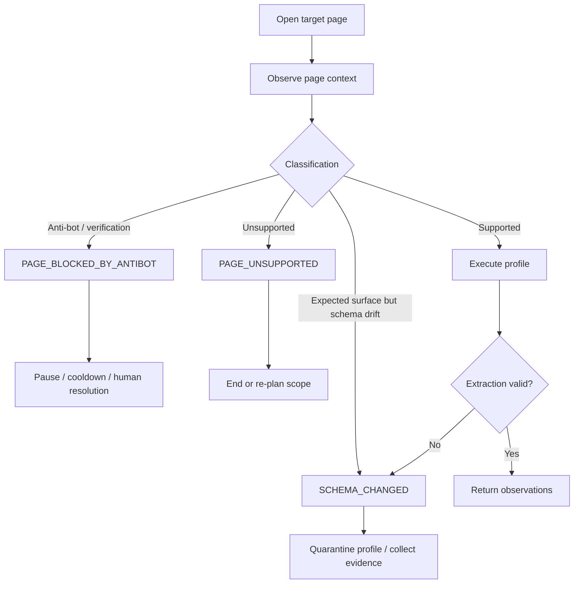

## D8 — Pause / Resume Sequence (Target Operator Interaction)

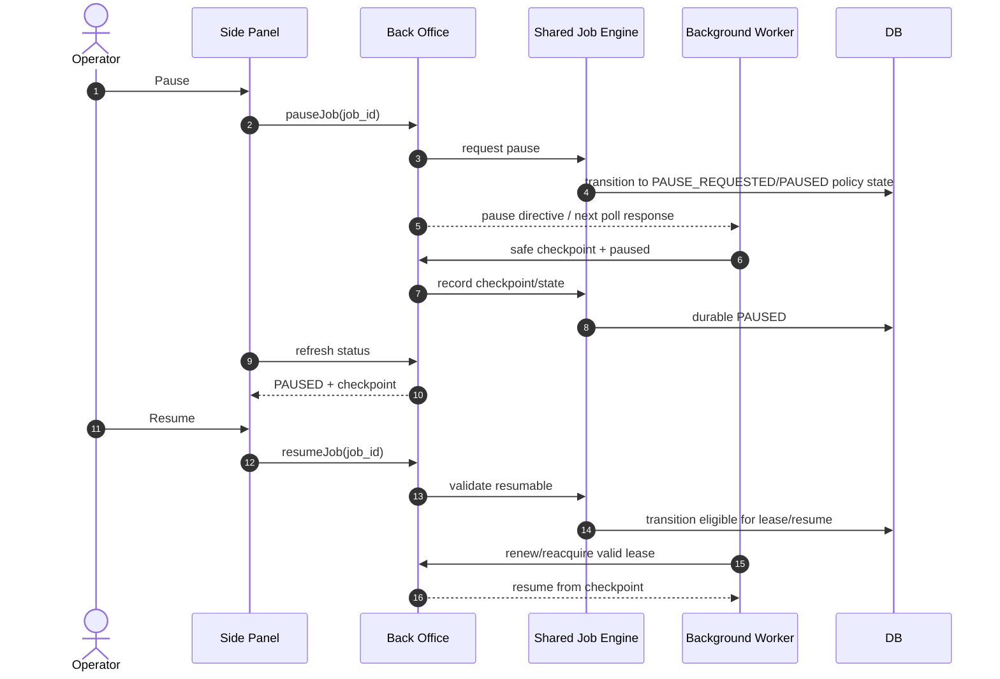

## D9 — Service Worker Restart Recovery

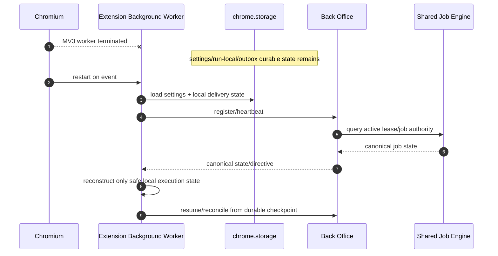

## D10 — Collection Profile Selection Sequence

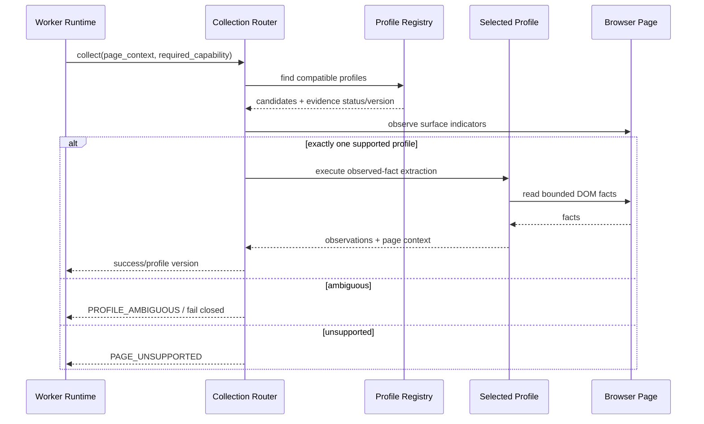

## D11 — Opportunity Feature Derivation Sequence

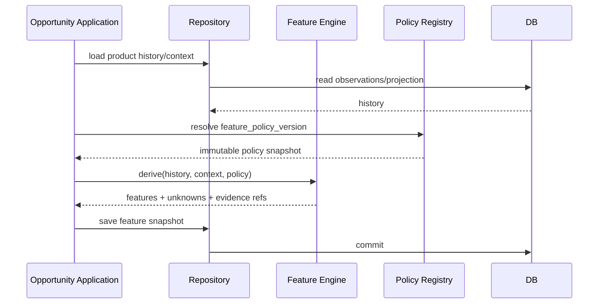

## D12 — Opportunity Evaluation Sequence

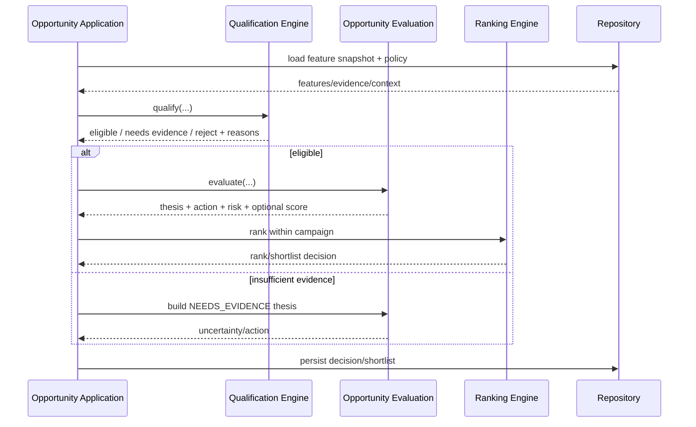

## D13 — Program 1 to Program 2 Handoff

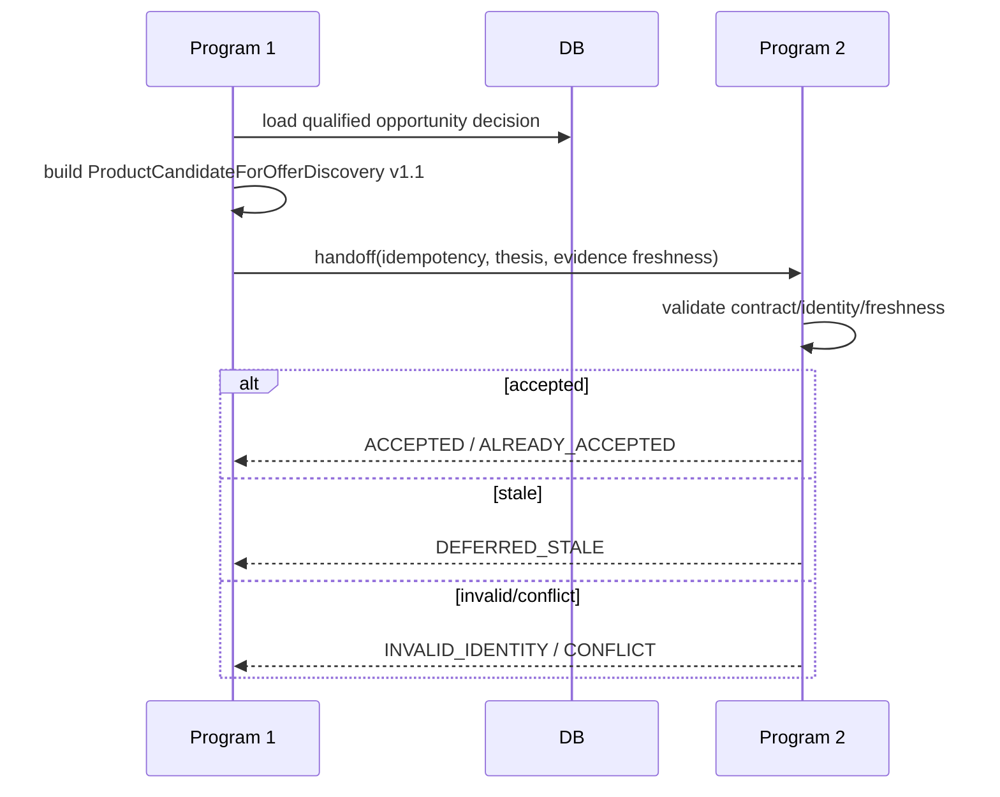

## D14 — Opportunity Lifecycle State

```mermaid
stateDiagram-v2
  [*] --> OBSERVED
  OBSERVED --> INSUFFICIENT_EVIDENCE
  OBSERVED --> FEATURE_READY
  INSUFFICIENT_EVIDENCE --> FEATURE_READY: more evidence

  FEATURE_READY --> QUALIFIED
  FEATURE_READY --> DEPRIORITIZED
  FEATURE_READY --> REJECTED

  QUALIFIED --> WATCH
  QUALIFIED --> TEST_NOW
  TEST_NOW --> SCALE: favorable outcome evidence
  TEST_NOW --> HOLD: inconclusive
  TEST_NOW --> STOP: poor/risk outcome
  WATCH --> TEST_NOW: condition improves
  SCALE --> HOLD: conditions deteriorate
  HOLD --> TEST_NOW: requalified
  DEPRIORITIZED --> WATCH: context changes
```

This lifecycle is a conceptual business-decision view, not a mutable single-field lifecycle that overrides versioned decision history.

## D15 — Evidence Lifecycle

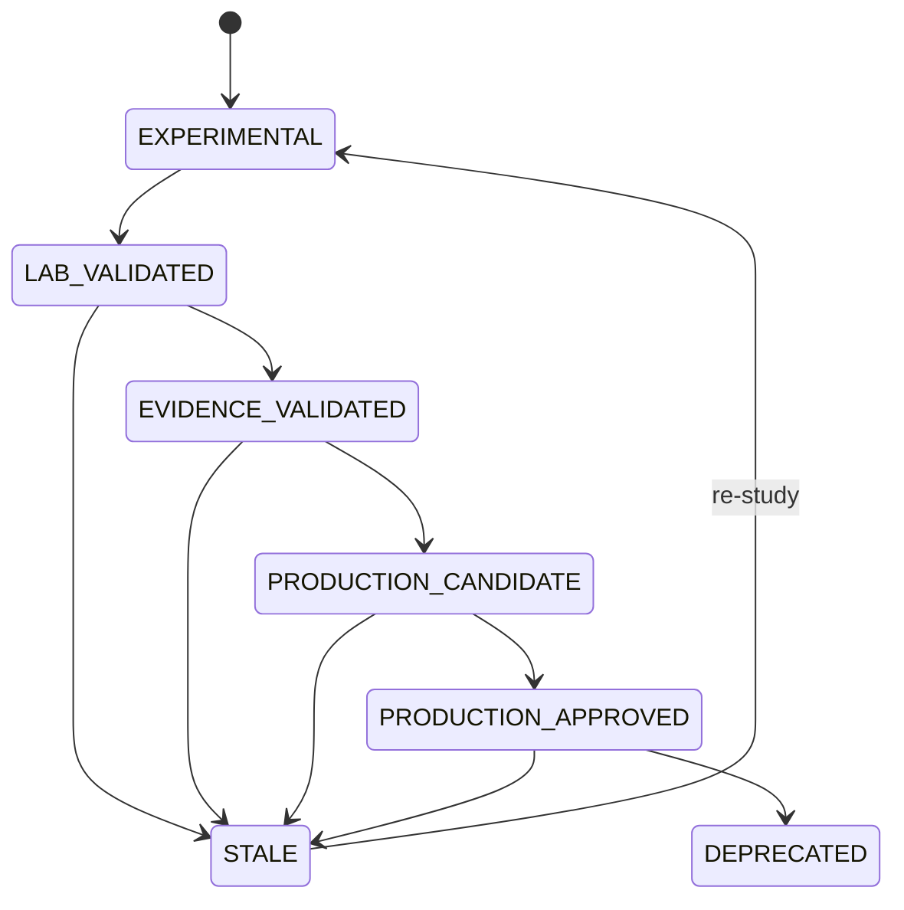

## D16 — Data Lineage / Traceability

```mermaid
flowchart LR
  H[Hypothesis]
    --> S[Signal Requirement]
    --> J[Discovery Job]
    --> E[Evidence / Profile]
    --> O[Observation]
    --> N[Normalized Fact]
    --> F[Feature Snapshot]
    --> D[Opportunity Decision]
    --> L[Shortlist]
    --> P2[Program 2 Candidate]
    --> C[Content / Publish]
    --> R[Outcome]
    --> M[Model/Policy Learning]
    --> H
```

## D17 — Portable Deployment

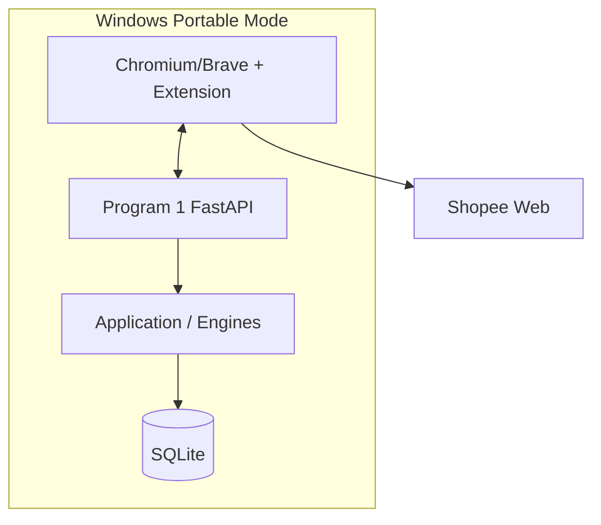

## D18 — Farm Deployment

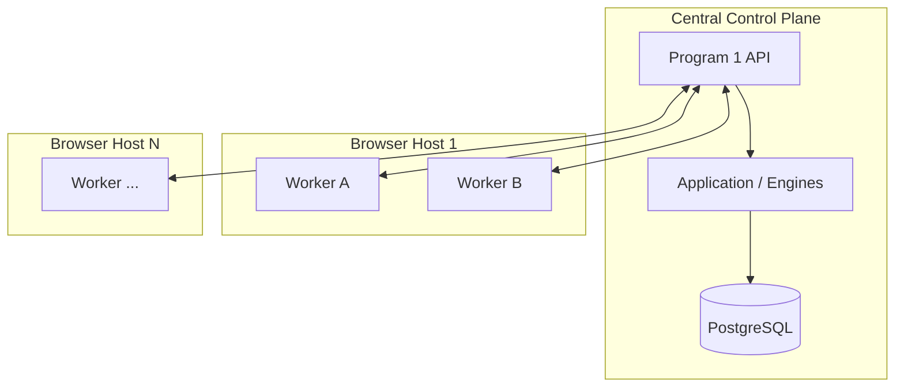

## D19 — Failure Containment

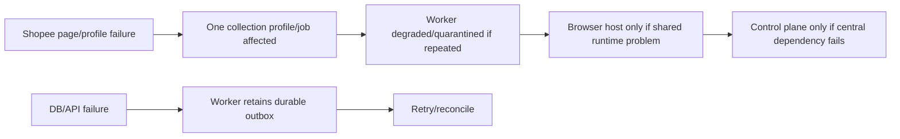

Rule: one bad page/profile/message must not silently corrupt unrelated opportunity decisions.

## D20 — Test Pyramid and Evidence Gate

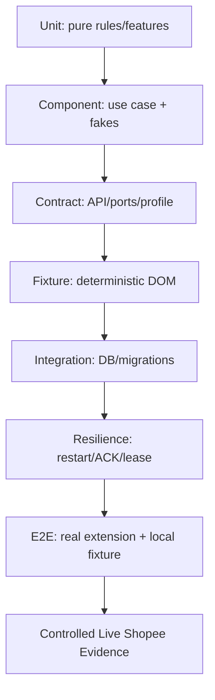

Live evidence validates adapters/profile assumptions. Core business logic should already be proven below that layer.

## Diagram Governance

A material change to Program 1 ownership, lifecycle, contracts, profile architecture, durable ACK semantics or opportunity decision flow requires updating the relevant diagram in this pack before/with implementation.

Diagrams are not decorative. They are part of the implementation handoff contract.

## Use-case coverage and implementation boundary — 2026-09-09

D1-D20 retain the governing architectural intent. D4 is an end-to-end target composition, not evidence that collection automatically triggers evaluation. D8 is the target operator interaction: do not infer dedicated Pause/Resume buttons from it (the current panel exposes Start/Stop). D11-D13 describe logical responsibilities; the concrete runtime may combine these in application services. D13 does not prove an automatic network push to Program 2. D18 is a deployment target, not a verified farm/scale claim. D7 classification names are conceptual; D10 uses the current PROFILE_AMBIGUOUS router result. Implementation status must be read with the current contract and verification record.

| Use case | Sequence | Governing contract | Implementation/test evidence |
|---|---|---|---|
| Strategy, campaign and discovery planning | D4 | PROGRAM1_SYSTEM_ARCHITECTURE.md | tests/component/test_program1_strategy_planner.py; operator campaign UI pending |
| Worker register and heartbeat | D21 | APPLICATION_AND_ENGINE_CONTRACTS.md | tests/contract/test_worker_registry_api_contract.py; tests/integration/sqlite/test_worker_registry_sqlite.py |
| Manual Capture and collector bootstrap | D22, D10 | PROGRAM1_CHROMIUM_E2E_AND_RESTART_SPEC.md | browser_plugin/program1/tests/manual_collector_bootstrap.test.mjs; real Brave single-page receipt evidence |
| Auto Run, lease, renew, checkpoint and pagination | D4, D23 | PROGRAM1_SYSTEM_ARCHITECTURE.md | browser_plugin/program1/tests/background_execution.test.mjs; Chromium restart harness; live pagination gated |
| Durable ingestion, duplicate ACK and image reference | D5, D24 | PROGRAM1_ACK_ACCOUNTING_CONTRACT.md; PROGRAM1_IMAGE_REFERENCE_CONTRACT.md | tests/integration/sqlite/test_program1_durable_batch.py; tests/unit/test_program1_image_reference.py |
| Delivery retry, quarantine and operator recovery | D25 | PROGRAM1_ACK_ACCOUNTING_CONTRACT.md | browser_plugin/program1/tests/delivery_reliability.test.mjs; no automatic quarantine repair UI claimed |
| Pause/resume and restart reconciliation | D8, D9 | PROGRAM1_SYSTEM_ARCHITECTURE.md | browser_plugin/program1/tests/background_execution.test.mjs; canonical job transitions remain Back Office owned |
| Read observations/history and image reference | D26 | PROGRAM1_IMAGE_REFERENCE_CONTRACT.md | tests/contract/test_program1_observation_evidence.py; catalog/image UI pending |
| Restore receipt and inspect delivery status | D27 | PROGRAM1_ACK_ACCOUNTING_CONTRACT.md | browser_plugin/program1/tests/background_transport.test.cjs; Chromium panel reload scenario |
| Derive features, evaluate, review shortlist | D11, D12 | PROGRAM1_AFFILIATE_SUCCESS_STRATEGY.md | tests/component/test_program1_opportunity_flow.py; production scoring gated |
| Qualified handoff to Program 2 | D13 | PROGRAM1_TO_PROGRAM2_HANDOFF_CONTRACT.md | tests/contract/test_program1_opportunity_api_contract.py; no Program2 implementation expansion |
| Download/cache images; outcome attribution | Not implemented | Separate approved contract required | P1-IMG-1 stores URLs only; do not invent a download sequence as current behavior |

## D21 — Register / Refresh Worker and Heartbeat

```mermaid
sequenceDiagram
  actor OP as Operator
  participant UI as Settings Panel
  participant BW as Background Worker
  participant ST as Local Storage
  participant API as Registry API
  participant APP as Registry Application
  participant REP as Registry Repository
  OP->>UI: Save backend URL and worker ID
  UI->>BW: Save settings and register
  BW->>ST: Read or persist installation ID
  BW->>API: Register worker ID, installation ID, version, capabilities
  API->>APP: register
  APP->>REP: Atomic insert or refresh
  alt New worker or same installation
    REP-->>APP: Committed worker record
    APP-->>API: Record
    API-->>BW: Registered
    BW-->>UI: Registry status
    BW->>API: Heartbeat with reportable health
    API->>APP: Record heartbeat
    APP->>REP: Commit liveness
  else Worker ID belongs to another installation
    REP-->>APP: Registration conflict
    APP-->>API: Conflict
    API-->>BW: HTTP 409
    BW-->>UI: Registration failed
    Note over OP,REP: Choose an unused ID; never overwrite another installation
  end
  Note over APP,REP: Re-registration does not resurrect a Back Office disabled worker
```

## D22 — Manual Capture on a Fresh Tab

```mermaid
sequenceDiagram
  actor OP as Operator
  participant UI as Side Panel
  participant BR as Browser Bridge
  participant CR as Collector Router and Profiles
  participant BW as Background Runtime
  participant ST as Durable Outbox
  OP->>UI: Capture Current Page
  UI->>BR: Find active supported web tab and check permission
  alt Permission denied or unsupported tab
    BR-->>UI: Structured failure
    UI-->>OP: Show blocked state; no success
  else Allowed tab
    UI->>BR: Inject core, profiles, router, then content bridge
    Note over BR,CR: Idempotent bootstrap installs one message receiver
    UI->>BR: Send capture message
    BR->>CR: Classify page and select versioned profile
    alt Blocked, ambiguous or missing receiver
      CR-->>UI: Failure via bridge
      UI-->>OP: Show error; do not queue fabricated observations
    else Supported capture
      CR-->>UI: Observations and pagination facts
      UI->>UI: Attach worker provenance and batch ID
      UI->>BW: Queue batch
      BW->>ST: Commit local message
      BW->>BW: Drain delivery using D24 and D25
      BW-->>UI: Current batch receipt or pending/failure
      UI-->>OP: Render confirmed receipt separately from telemetry
    end
  end
  Note over UI,BW: Manual capture does not create a canonical campaign or claim completion of an unleased job
```

## D23 — Background Auto Cycle and Last Page

```mermaid
sequenceDiagram
  participant WA as Wake or Operator Start
  participant BW as Background Controller
  participant LC as Job Lifecycle Client
  participant BO as Back Office Job Application
  participant CR as Browser Collector
  participant ST as Local Storage
  WA->>BW: Execute bounded cycle
  BW->>LC: Reconcile active work or lease compatible job
  LC->>BO: Validate worker and lease authority
  BO-->>LC: Canonical work and valid token or no work
  alt No eligible work or invalid authority
    LC-->>BW: Stop or reconcile
    BW->>ST: Persist local stopped state
  else Valid work
    BW->>CR: Open or recover tab and collect
    CR-->>BW: Observations and observed pagination
    BW->>BW: Durable delivery D24
    alt Current batch has no valid accounted receipt
      BW->>ST: Persist blocked state; retain recoverable evidence
    else Current batch accounted
      BW->>LC: Checkpoint current receipt and page facts
      LC->>BO: Validate lease and persist checkpoint
      alt Observed has_next is false
        BW->>LC: Verify and complete
        LC->>BO: Canonical verification and completion
        BO-->>LC: Completed job
        BW->>ST: Clear local active work; terminal run
      else More work according to profile
        BW->>CR: Advance using profile pagination evidence
        BW->>ST: Persist local progress and schedule wake
        Note over BW,BO: Delay waits outside database transactions; renew/reconcile before further side effects
      end
    end
  end
```

## D24 — Atomic Observation / Image Reference Ingestion

```mermaid
sequenceDiagram
  participant BW as Worker
  participant API as Program 1 API
  participant APP as Program1Service
  participant ING as Batch Ingestor Port and SQL Adapter
  participant DB as SQLite
  BW->>API: Batch identity and observations with optional image URL
  API->>API: Validate payload and HTTP(S) image reference
  alt Invalid input or missing job binding
    API-->>BW: HTTP 422; no ACK
  else Valid input
    API->>APP: ingest_batch
    APP->>APP: Fingerprint payload; omit null image field for legacy compatibility
    APP->>ING: Atomic ingest with fingerprint
    ING->>DB: Begin transaction and inspect batch receipt
    alt Existing batch and same fingerprint
      DB-->>ING: Original accepted and received counts
    else Batch or observation identity has changed payload
      ING->>DB: Rollback
      ING-->>API: Conflict via application
      API-->>BW: HTTP 409; no successful receipt
    else New batch
      ING->>DB: Insert new observations; account exact duplicates
      ING->>DB: Insert receipt and commit together
      DB-->>ING: Durable result
    end
    opt Ingestion returned a durable result
      ING-->>APP: Original batch counts
      APP-->>API: Accepted, duplicate and accounted counts
      API-->>BW: Versioned ACK
    end
  end
  Note over API,DB: No image fetch, browser wait or network wait in transaction
  Note over APP,DB: URL is observed evidence, not an image file or new-product count
```

## D25 — Drain / Retry / Quarantine and Local Commit Failure

```mermaid
sequenceDiagram
  participant BW as Background Drain
  participant ST as Serialized Local Storage
  participant API as Back Office
  participant UI as Operator Status
  BW->>ST: Read pending messages
  loop Each pending message until blocking failure
    BW->>API: Submit original payload and batch ID
    alt Valid accounted ACK
      API-->>BW: Receipt
      BW->>BW: Validate identity, version and integer totals
      BW->>ST: One update stores last receipt and removes message
      alt Local update succeeds
        BW-->>UI: Confirmed delivery
      else Local update fails
        BW-->>UI: Retained or uncertain; retry original identity
      end
    else Permanent payload HTTP 400/409/413/415/422
      BW->>ST: Move message to quarantine with reason
      Note over BW,ST: Continue only after successful quarantine write
    else Network, transient, authentication or unknown failure
      BW-->>UI: Retain message and stop this drain
    else Malformed or ambiguous ACK
      BW-->>UI: Retain and require reconciliation
    end
  end
  Note over BW,UI: Original IDs survive retry; no blind payload rewrite or automatic quarantine repair
```

## D26 — Read Product Observation History / Image Evidence

```mermaid
sequenceDiagram
  actor OP as Operator or API Client
  participant API as Program 1 API
  participant APP as Program1Service
  participant REP as Product Repository Port
  participant DB as SQLite Adapter
  OP->>API: GET product observations with limit
  alt Limit outside 1..100
    API-->>OP: HTTP 422
  else Valid limit
    API->>APP: observation_evidence(product key, limit)
    APP->>REP: observation_history(product key)
    REP->>DB: Read stored observations
    DB-->>REP: History including nullable image reference
    REP-->>APP: Chronological history
    APP->>APP: Return newest first with bounded count
    APP-->>API: Evidence list
    API-->>OP: HTTP 200; empty list if unknown
  end
  Note over APP,DB: Response limit is not storage pagination; no remote image fetch
```

## D27 — Restore Last Receipt After Panel Reopen

```mermaid
sequenceDiagram
  actor OP as Operator
  participant UI as Side Panel
  participant BW as Background Runtime
  participant ST as Local Storage
  OP->>UI: Open panel or refresh status
  UI->>BW: Get process status
  BW->>ST: Read outbox and last persisted receipt
  ST-->>BW: Stored evidence and backend association
  alt Receipt backend matches current settings
    BW-->>UI: Last receipt and pending outbox count
    UI-->>OP: Original-batch counts and pending delivery separately
  else Missing receipt or another backend
    BW-->>UI: No current-backend receipt
    UI-->>OP: No confirmed receipt available
  end
  Note over UI,ST: Panel reopen never owns job transitions or reconstructs success from UI counters
```

## D28 — Operator Product Review

The governing sequence and failure branches are in PROGRAM1_OPERATOR_REVIEW_CONTRACT.md. It extends D26 with a paged latest-product list and a read-only daisyUI shell. Implementation: Program1Service.product_evidence_page, Program1 runtime static mount, BackOffice.vue. Evidence: tests/contract/test_program1_observation_evidence.py and real Brave list/history readback. No remote image fetch or business mutations.
