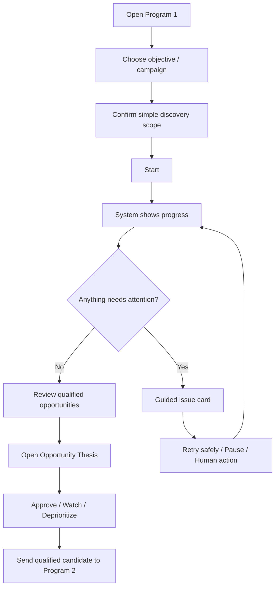

# Program 1 — UX and Operator Experience Architecture

Status: GOVERNING UX POLICY
Date: 2026-09-04

## 1. Goal

Program 1 must be usable by both:
- knowledgeable technical operators;
- users with limited technical knowledge.

Ease of use is a product requirement, not decoration added after engineering.

The system should hide implementation complexity while preserving evidence and advanced diagnostics for support.

## 2. UX Principles

1. **Task language, not system language.**
   Prefer "ค้นหาสินค้าที่น่าทดลอง" over "DISCOVER_PRODUCTS lease".

2. **Safe defaults.**
   A new user should succeed without understanding internal configuration.

3. **Progressive disclosure.**
   Show essential status first; technical details only when requested.

4. **Explain every important decision.**
   Opportunity recommendations should answer "why".

5. **Never show false success.**
   Blocked/unsupported/uncertain states must be explicit.

6. **Recovery should be guided.**
   Errors should state what happened, whether data is safe, and what the user should do.

7. **UI restart is harmless.**
   Closing/reopening UI must not lose durable work.

8. **Pause is safe and understandable.**
   User does not need to understand lease/checkpoint details.

9. **Evidence confidence is visible.**
   Distinguish experimental/lab/evidence-validated data.

10. **Do not expose implementation detail as required knowledge.**

## 3. Primary Operator Journey



## 4. Information Hierarchy

### Level 1 — Simple View
Show:
- current objective;
- system state;
- progress;
- number of observations/candidates;
- qualified opportunities;
- blocked/attention status;
- next recommended action.

### Level 2 — Explanation View
Show:
- why product is interesting;
- evidence freshness;
- strengths;
- risks;
- missing evidence;
- recommendation.

### Level 3 — Advanced / Support View
Show:
- job_id;
- worker_id;
- profile/version;
- checkpoint;
- outbox;
- correlation ID;
- structured error;
- evidence references.

A novice should not need Level 3.

## 5. Status Vocabulary

Prefer user-facing states:

- พร้อมใช้งาน
- กำลังค้นหา
- กำลังวิเคราะห์
- หยุดชั่วคราว
- ต้องการข้อมูลเพิ่ม
- ถูกจำกัดโดยหน้าเว็บไซต์
- ต้องการให้ผู้ใช้ดำเนินการ
- เสร็จสิ้น
- มีปัญหา แต่ข้อมูลปลอดภัย

Map internal technical states to these read models.

Do not expose raw enum/error codes as the only explanation.

## 6. Error Message Contract

Every user-facing error should answer:

1. What happened?
2. Did the system lose data?
3. Is it safe to retry?
4. What should the user do?
5. Is technical support information available?

Example structure:

```text
Shopee แสดงหน้าตรวจสอบการใช้งาน
งานถูกหยุดชั่วคราวและข้อมูลที่เก็บแล้วไม่สูญหาย
โปรดเปิด Shopee ตามปกติและดำเนินการตรวจสอบให้เสร็จ
จากนั้นกด "ทำงานต่อ"

รายละเอียดสำหรับฝ่ายเทคนิค: [expand]
```

## 7. New User Defaults

Initial setup should minimize required fields.

Prefer:
- automatic local Back Office URL detection;
- generated/suggested worker identity;
- safe default profile;
- guided permission request;
- simple campaign presets;
- conservative pacing derived from approved config/evidence.

Do not require users to edit JSON/TOML for ordinary use.

Advanced configuration remains available separately.

## 8. Opportunity Presentation

A candidate should not be shown only as a number.

Preferred card:

```text
Product
Recommended action: TEST_NOW

Why now:
- ...
Evidence:
- ...
Content opportunities:
- ...
Risks:
- ...
Missing evidence:
- ...
Last observed:
- ...
```

Score is secondary unless validated and meaningful.

## 9. Accessibility and Clarity

Use:
- readable typography;
- adequate contrast;
- consistent terminology;
- clear disabled-state reasons;
- keyboard-accessible controls where practical;
- no meaning conveyed only by color;
- concise Thai-first operator text for the target user base;
- stable icons + labels, not icons alone for critical actions.

## 10. Dangerous / Confusing Actions

Pause, stop, clear, reset and delete actions must be semantically distinct.

Examples:
- Pause: retain job/checkpoint and allow resume.
- Stop/Cancel: end current job according to lifecycle contract.
- Clear local cache/outbox: advanced/support action and never silently remove unacknowledged durable evidence.

Confirmation dialogs are required only where the action has meaningful irreversible/destructive impact; avoid confirmation fatigue.

## 11. UI Architecture

```text
View
 -> ViewModel/Presentation Store
 -> Application Facade / API
 -> Application/Engines
```

UI may:
- submit commands;
- query read models;
- display telemetry;
- show approval actions.

UI may not:
- own job state machine;
- implement scoring;
- decide retries;
- parse Shopee DOM;
- mutate canonical DB directly.

## 12. UX Test Strategy

Most workflow correctness is tested headlessly.

UI-specific tests:
- correct command mapping;
- novice/default setup;
- status mapping;
- error explanation rendering;
- pause/resume buttons based on read model;
- advanced-details progressive disclosure;
- reconnect/refresh;
- accessibility basics.

Usability acceptance should include scenario walkthroughs by a non-technical user profile.

## 13. UX Definition of Done

Any operator-facing card is not Done unless:
- ordinary path can be understood without technical knowledge;
- safe default exists or the reason it cannot exist is documented;
- errors provide a next action;
- technical detail is not required for normal operation;
- close/reopen does not corrupt durable work;
- headless core tests exist independently of UI tests.
