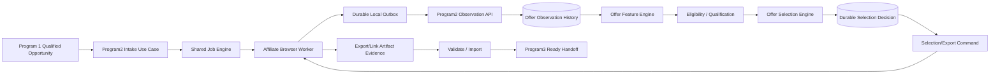

# Program 2 — System Architecture

Status: IMPLEMENTATION READY BASELINE
Date: 2026-09-04

## Responsibility model

Back Office owns commercial authority. Browser/affiliate workers observe facts and execute bounded instructed actions.

## Layering

UI / CLI / FastAPI
-> Program2 Application Use Cases
-> Affiliate Offer Domain / Engines / Policies
-> Repository / Browser / Artifact Ports
-> SQLAlchemy / Extension / File adapters

Domain/engine layers must not import FastAPI, SQLAlchemy, browser DOM APIs or UI frameworks.

## Authoritative state

| State | Owner |
|---|---|
| Program1 admission evidence | Program1 durable handoff |
| executable lifecycle | Shared Job Engine |
| worker identity/health | Shared Worker Registry |
| offer observation/history | Program2 repository |
| eligibility/qualification | Affiliate Offer Engine |
| preferred/backups | Program2 Selection Decision |
| export/link validation | Program2 application + artifact repository |
| presentation state | UI only |

## Core domain objects

- AffiliateOfferObservation
- OfferFeatureSnapshot
- OfferQualificationDecision
- OfferSelectionDecision
- AffiliateLinkArtifact
- Program3OfferHandoff
- AffiliateAccountContext
- OfferDiscoveryPlan

## Reliability invariants

1. Same logical observation/batch replay is idempotent.
2. Job-bound observations require active worker lease provenance.
3. Selection is deterministic for same facts/context/policy version.
4. Selection records policy/model version and evidence refs.
5. Stale selection may not silently become Program3-ready.
6. Export command is idempotent or reconciliation-protected.
7. Ambiguous export outcome is OUTCOME_UNKNOWN/NEEDS_HUMAN, not success.
8. No external wait inside SQL transaction.
9. Worker restart cannot erase acknowledged work.
10. UI closure does not own or terminate job truth.

## Deployment

Portable: SQLite + local browser worker.
Farm: PostgreSQL + multiple browser workers.
Test: in-memory/fakes + sanitized fixtures.

No domain redesign between modes.
