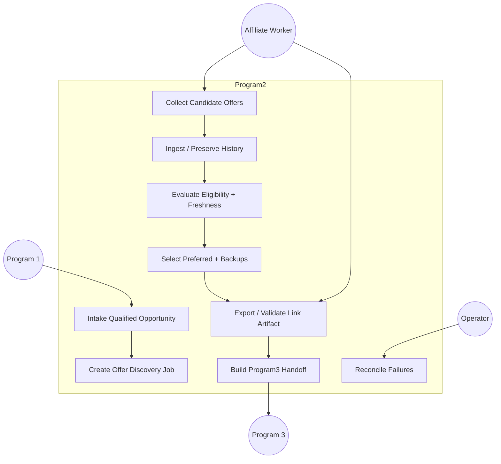
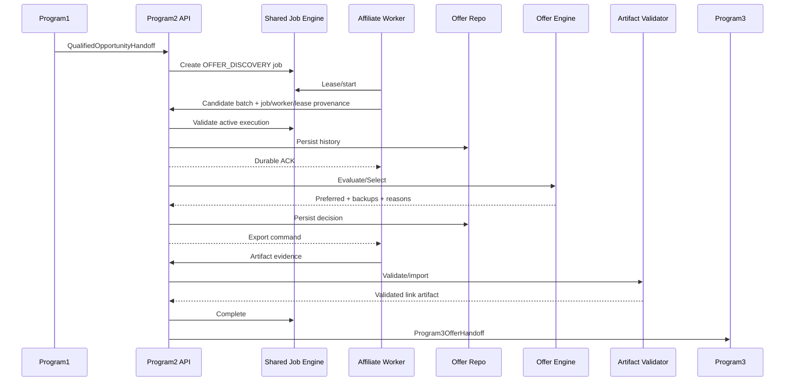
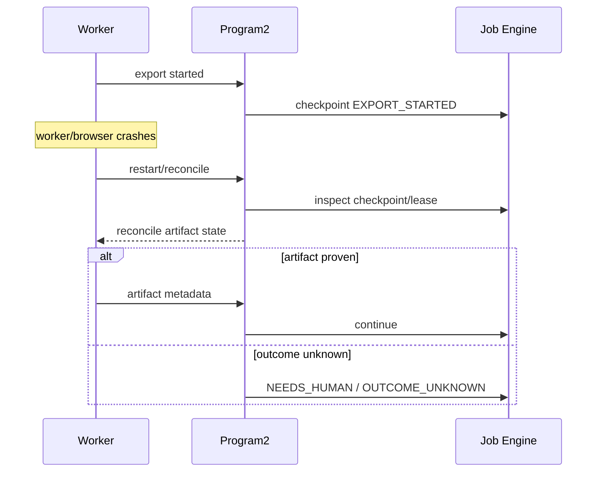
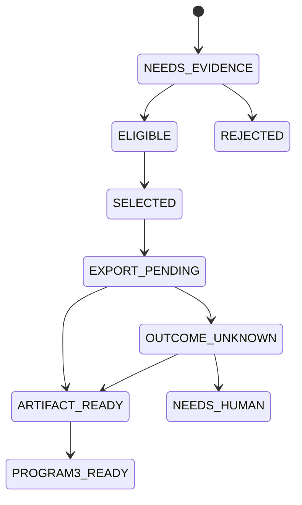

# Program 2 — UML and Runtime Diagrams

Status: IMPLEMENTATION HANDOFF
Date: 2026-09-04

## Use-case view

```mermaid
flowchart TB
  Operator((Operator))
  P1((Program 1))
  P3((Program 3))
  Worker((Affiliate Worker))
  subgraph Program2
    U1[Intake Qualified Opportunity]
    U2[Create Offer Discovery Job]
    U3[Collect Candidate Offers]
    U4[Ingest / Preserve History]
    U5[Evaluate Eligibility + Freshness]
    U6[Select Preferred + Backups]
    U7[Export / Validate Link Artifact]
    U8[Build Program3 Handoff]
    U9[Reconcile Failures]
  end
  P1 --> U1
  U1 --> U2
  Worker --> U3
  U3 --> U4
  U4 --> U5 --> U6 --> U7 --> U8 --> P3
  Worker --> U7
  Operator --> U9
```

## Sequence — normal path

```mermaid
sequenceDiagram
  participant P1 as Program1
  participant P2 as Program2 API
  participant J as Shared Job Engine
  participant W as Affiliate Worker
  participant O as Offer Repo
  participant E as Offer Engine
  participant A as Artifact Validator
  participant P3 as Program3
  P1->>P2: QualifiedOpportunityHandoff
  P2->>J: Create OFFER_DISCOVERY job
  W->>J: Lease/start
  W->>P2: Candidate batch + job/worker/lease provenance
  P2->>J: Validate active execution
  P2->>O: Persist history
  P2-->>W: Durable ACK
  P2->>E: Evaluate/Select
  E-->>P2: Preferred + backups + reasons
  P2->>O: Persist decision
  P2-->>W: Export command
  W->>P2: Artifact evidence
  P2->>A: Validate/import
  A-->>P2: Validated link artifact
  P2->>J: Complete
  P2->>P3: Program3OfferHandoff
```

## Sequence — ambiguous export

```mermaid
sequenceDiagram
  participant W as Worker
  participant P2 as Program2
  participant J as Job Engine
  W->>P2: export started
  P2->>J: checkpoint EXPORT_STARTED
  Note over W: worker/browser crashes
  W->>P2: restart/reconcile
  P2->>J: inspect checkpoint/lease
  P2-->>W: reconcile artifact state
  alt artifact proven
    W->>P2: artifact metadata
    P2->>J: continue
  else outcome unknown
    P2->>J: NEEDS_HUMAN / OUTCOME_UNKNOWN
  end
```

## State model

```mermaid
stateDiagram-v2
  [*] --> NEEDS_EVIDENCE
  NEEDS_EVIDENCE --> ELIGIBLE
  NEEDS_EVIDENCE --> REJECTED
  ELIGIBLE --> SELECTED
  SELECTED --> EXPORT_PENDING
  EXPORT_PENDING --> ARTIFACT_READY
  EXPORT_PENDING --> OUTCOME_UNKNOWN
  OUTCOME_UNKNOWN --> ARTIFACT_READY
  OUTCOME_UNKNOWN --> NEEDS_HUMAN
  ARTIFACT_READY --> PROGRAM3_READY
```
