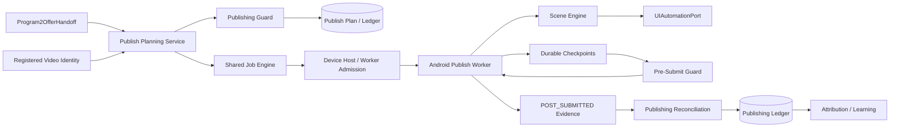

# Program 3 — System Architecture

Status: IMPLEMENTATION READY BASELINE
Date: 2026-09-04

## Layering

UI / CLI / FastAPI
-> Program3 Application Use Cases
-> Publishing / Scene / Device domain engines
-> Ports
-> SQL / Android / ADB / uiautomator2 / evidence adapters

## Authoritative ownership

| State/resource | Authority |
|---|---|
| Program2 commercial handoff | Program2 durable handoff |
| video identity | Content Identity |
| PublishPlan | Program3 Back Office |
| executable job lifecycle | Shared Job Engine |
| device ownership | Device Host Engine/Host Manager |
| Scene recognition/action policy | Scene Engine |
| Android selectors/actions | adapter |
| POST_SUBMITTED boundary | Program3 Back Office record/checkpoint |
| canonical publish outcome | Publishing Engine/Ledger |
| UI presentation | UI only |

## Key invariants

1. A PublishPlan must reference validated Program2 handoff evidence.
2. Duplicate guard runs before queue and immediately before submit.
3. Offer/link freshness is rechecked before submit.
4. One active automation owner per device.
5. Worker must hold valid job lease.
6. Unknown Scene causes no business tap.
7. POST_SUBMITTED is idempotently durable.
8. After POST_SUBMITTED, worker cannot automatically issue SUBMIT again without confirmed safe-to-retry decision.
9. Confirmed success is durable and attributable.
10. UI close/restart cannot invalidate canonical job/publish state.
