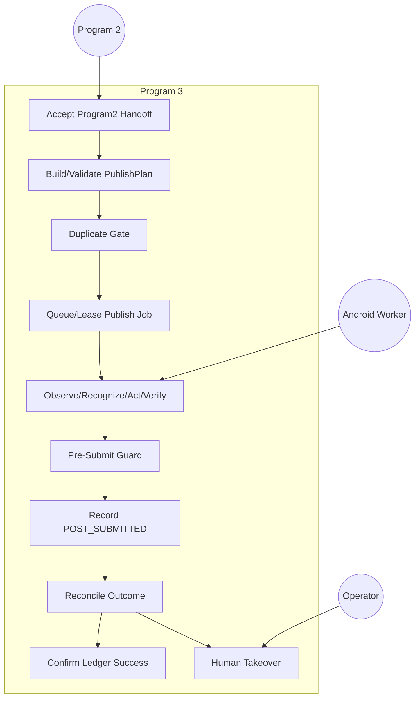
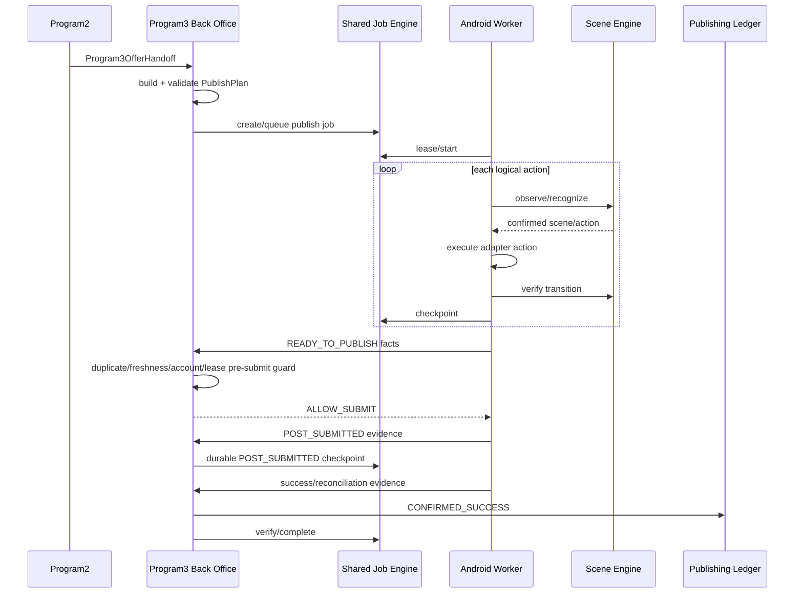
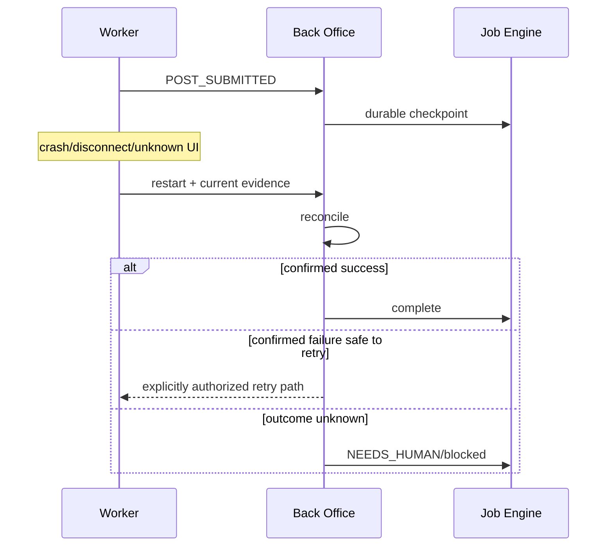
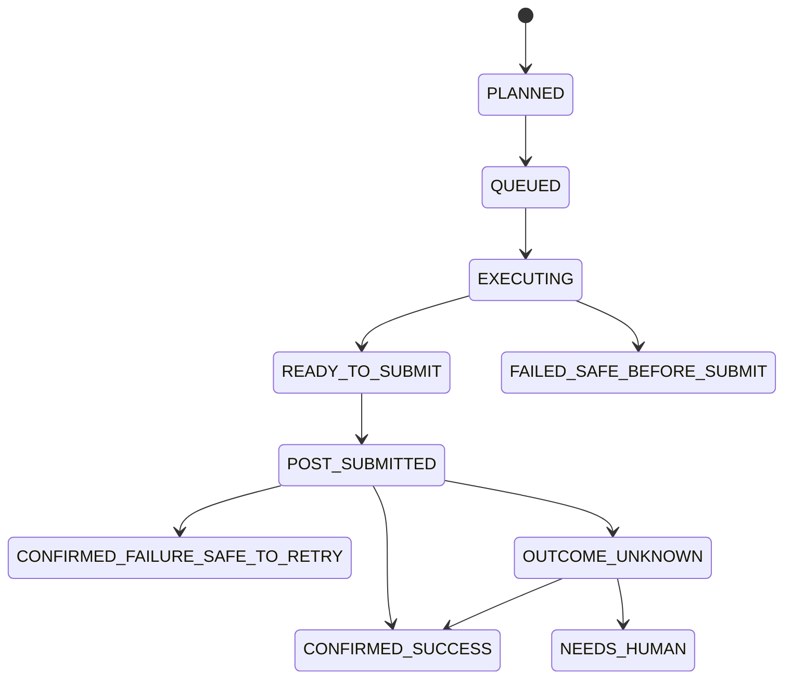

# Program 3 — UML and Runtime Diagrams

Status: IMPLEMENTATION HANDOFF
Date: 2026-09-04

## Use cases

```mermaid
flowchart TB
  P2((Program 2))
  Operator((Operator))
  Android((Android Worker))
  subgraph P3[Program 3]
    U1[Accept Program2 Handoff]
    U2[Build/Validate PublishPlan]
    U3[Duplicate Gate]
    U4[Queue/Lease Publish Job]
    U5[Observe/Recognize/Act/Verify]
    U6[Pre-Submit Guard]
    U7[Record POST_SUBMITTED]
    U8[Reconcile Outcome]
    U9[Confirm Ledger Success]
    U10[Human Takeover]
  end
  P2 --> U1 --> U2 --> U3 --> U4 --> U5 --> U6 --> U7 --> U8 --> U9
  Android --> U5
  Operator --> U10
  U8 --> U10
```

## Normal sequence

```mermaid
sequenceDiagram
  participant P2 as Program2
  participant P3 as Program3 Back Office
  participant J as Shared Job Engine
  participant W as Android Worker
  participant S as Scene Engine
  participant L as Publishing Ledger
  P2->>P3: Program3OfferHandoff
  P3->>P3: build + validate PublishPlan
  P3->>J: create/queue publish job
  W->>J: lease/start
  loop each logical action
    W->>S: observe/recognize
    S-->>W: confirmed scene/action
    W->>W: execute adapter action
    W->>S: verify transition
    W->>J: checkpoint
  end
  W->>P3: READY_TO_PUBLISH facts
  P3->>P3: duplicate/freshness/account/lease pre-submit guard
  P3-->>W: ALLOW_SUBMIT
  W->>P3: POST_SUBMITTED evidence
  P3->>J: durable POST_SUBMITTED checkpoint
  W->>P3: success/reconciliation evidence
  P3->>L: CONFIRMED_SUCCESS
  P3->>J: verify/complete
```

## Ambiguous submit sequence

```mermaid
sequenceDiagram
  participant W as Worker
  participant P3 as Back Office
  participant J as Job Engine
  W->>P3: POST_SUBMITTED
  P3->>J: durable checkpoint
  Note over W: crash/disconnect/unknown UI
  W->>P3: restart + current evidence
  P3->>P3: reconcile
  alt confirmed success
    P3->>J: complete
  else confirmed failure safe to retry
    P3-->>W: explicitly authorized retry path
  else outcome unknown
    P3->>J: NEEDS_HUMAN/blocked
  end
```

## Publish outcome state

```mermaid
stateDiagram-v2
  [*] --> PLANNED
  PLANNED --> QUEUED
  QUEUED --> EXECUTING
  EXECUTING --> READY_TO_SUBMIT
  READY_TO_SUBMIT --> POST_SUBMITTED
  EXECUTING --> FAILED_SAFE_BEFORE_SUBMIT
  POST_SUBMITTED --> CONFIRMED_SUCCESS
  POST_SUBMITTED --> CONFIRMED_FAILURE_SAFE_TO_RETRY
  POST_SUBMITTED --> OUTCOME_UNKNOWN
  OUTCOME_UNKNOWN --> CONFIRMED_SUCCESS
  OUTCOME_UNKNOWN --> NEEDS_HUMAN
```
