# Sequence Diagrams — Implementation Handoff Pack

Status: DEVELOPMENT HANDOFF BASELINE
Purpose: Define runtime collaboration, ownership, transaction boundaries, ACK/idempotency behavior and recovery semantics across the platform.
Notation: Mermaid `sequenceDiagram`.

> Rule: sequence diagrams describe business/runtime collaboration. Concrete DOM selectors, Android coordinates and ORM internals must not leak into these contracts.

## SD-01 — Step 1 Product Discovery Happy Path

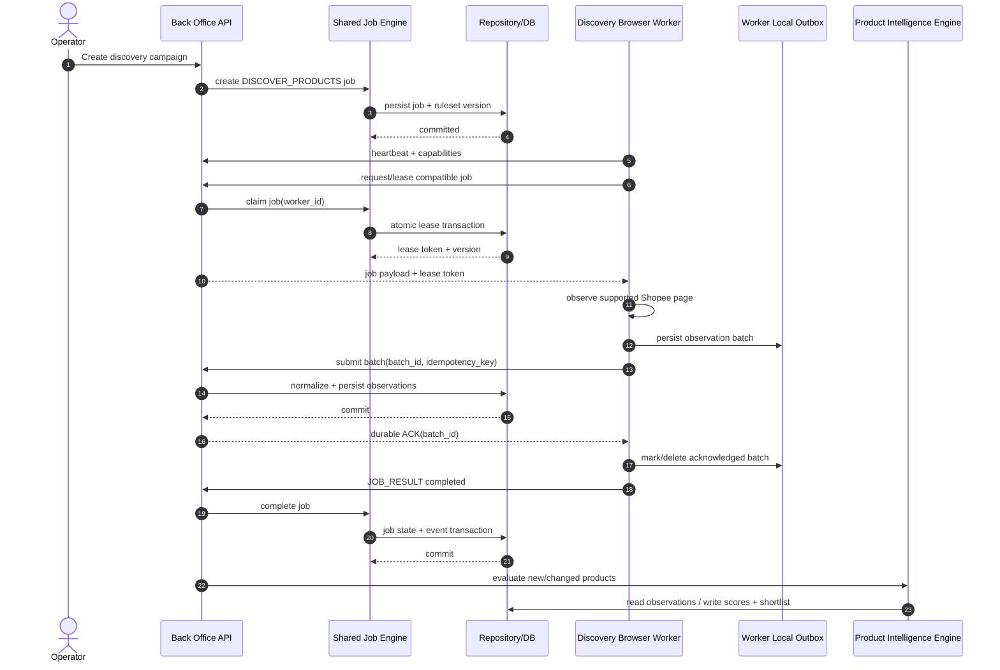

## SD-02 — Step 1 Outbox Retry / ACK Loss

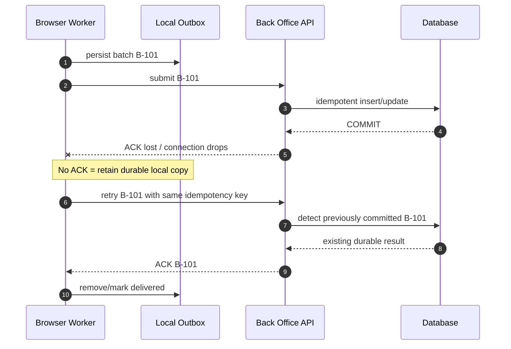

## SD-03 — Step 2 Affiliate Offer Discovery and Selection

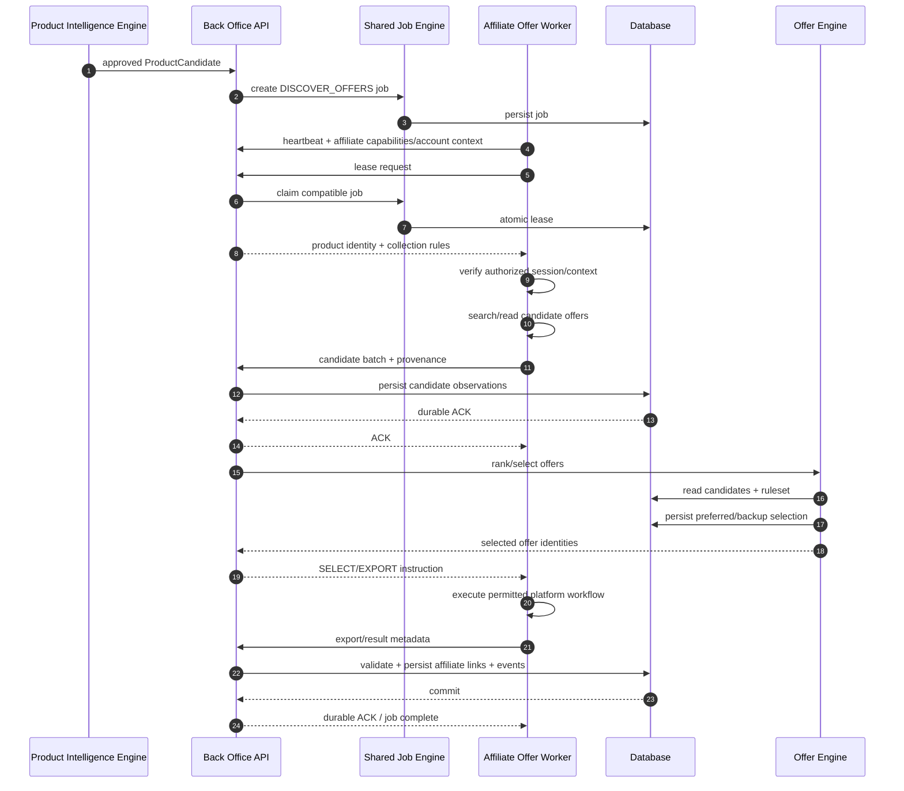

## SD-04 — Step 2 Session Required / Human Intervention

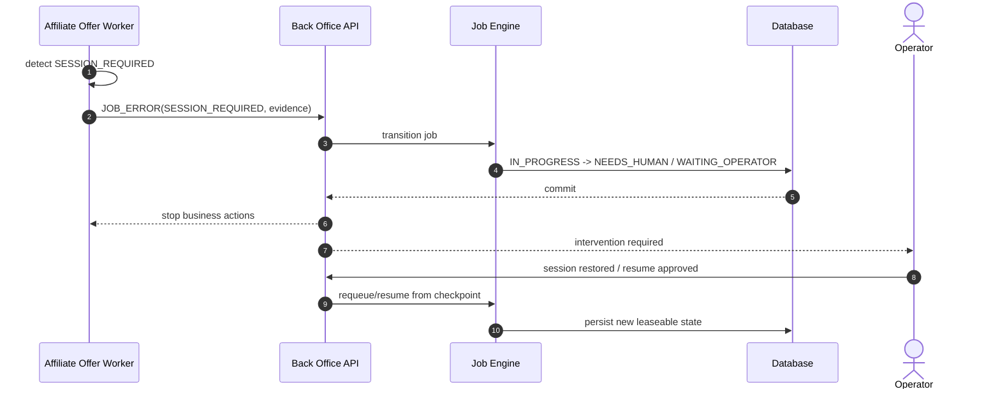

## SD-05 — Step 3 Publish Happy Path

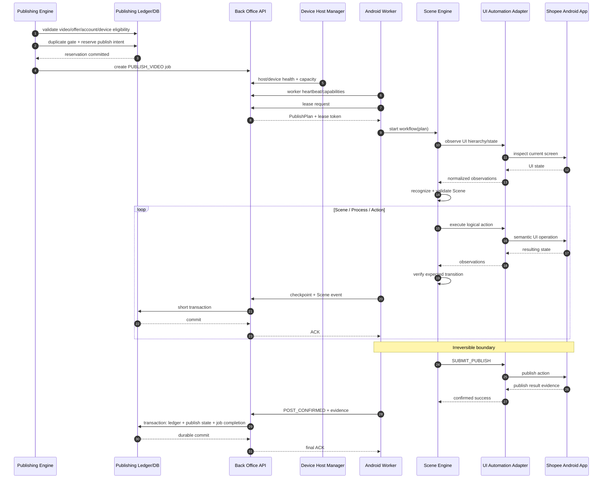

## SD-06 — Step 3 Scene Mismatch and Recovery

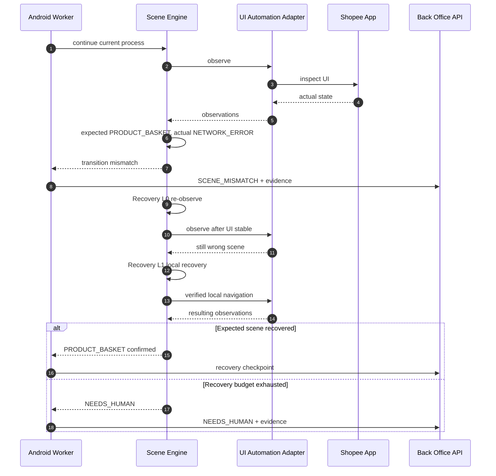

## SD-07 — Publish Outcome Unknown / Never Blind Repost

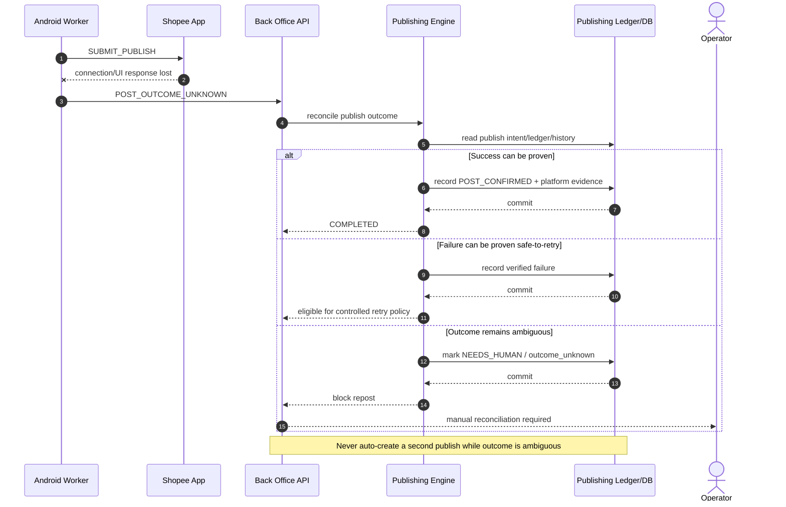

## SD-08 — Device Discovery, Worker Spawn and Ownership

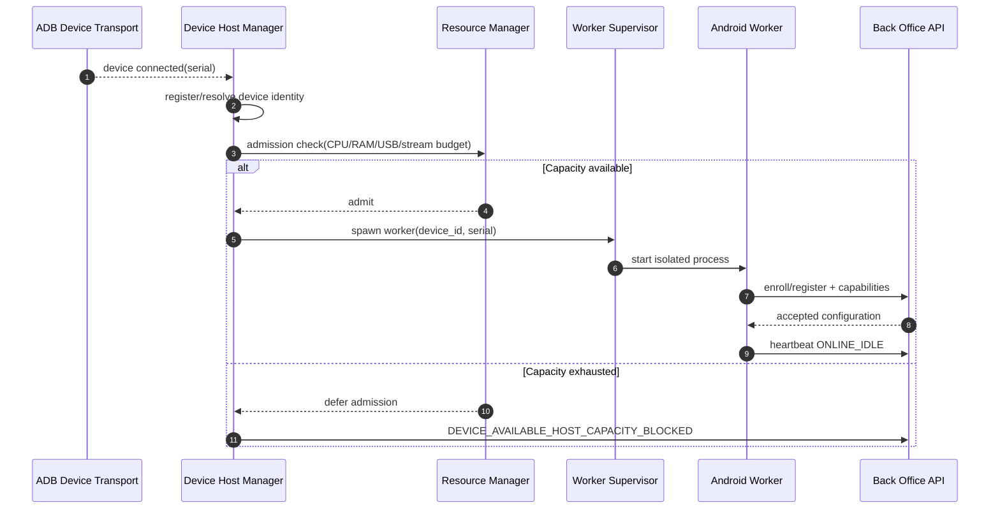

## SD-09 — Worker Crash, Lease Expiry and Safe Reassignment

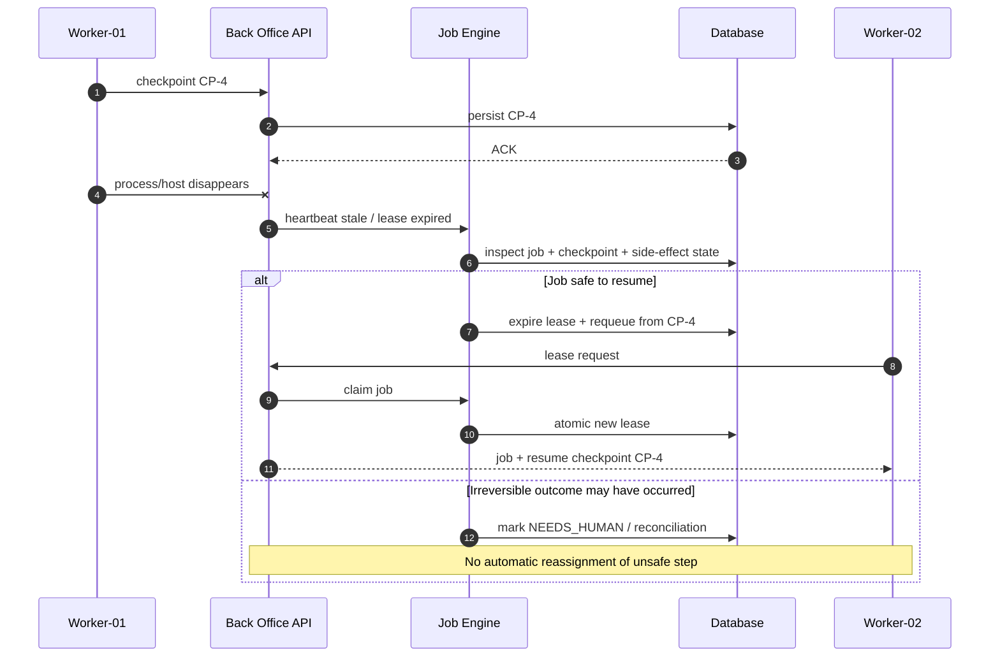

## SD-10 — API → Application → Engine → Repository Boundary

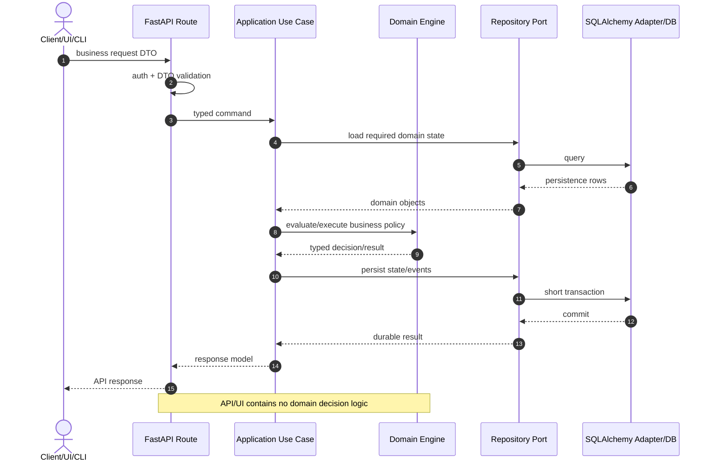

## SD-11 — Desktop UI as Optional Shell

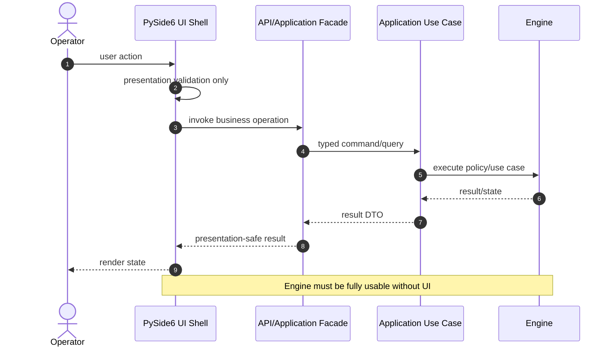

## SD-12 — Ruleset / Configuration Versioning During Job Execution

```mermaid
sequenceDiagram
    autonumber
    actor OP as Operator
    participant API as Back Office API
    participant CFG as Configuration Service
    participant JE as Job Engine
    participant DB as Database
    participant W as Worker

    OP->>API: publish new ruleset R2
    API->>CFG: validate + activate R2
    CFG->>DB: persist immutable R2 + active pointer
    DB-->>CFG: commit

    Note over JE,W: Existing job J1 was created under R1
    JE->>DB: read J1.ruleset_version = R1
    JE-->>W: dispatch J1 with effective R1 snapshot/version

    Note over API,DB: New jobs use R2; running jobs do not silently change semantics
```

## Sequence Diagram Coverage Rule

A feature is not Implementation Ready if its critical path crosses more than one runtime/component and none of the governing diagrams/specifications explains:

- initiating actor/component;
- authoritative owner of state;
- request/response/event contract;
- durable transaction/ACK boundary;
- idempotency/retry semantics;
- failure/ambiguity behavior;
- expected terminal state.

Sequence diagrams are normative for collaboration semantics but do not replace typed API contracts, state-machine specs or tests.
