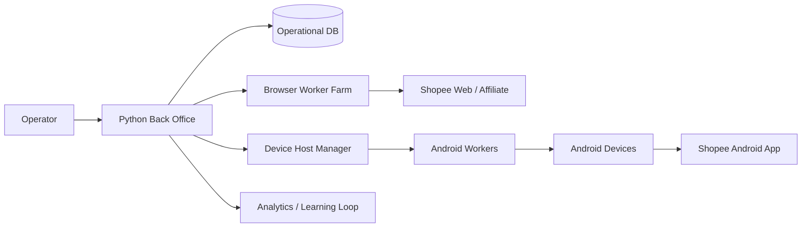
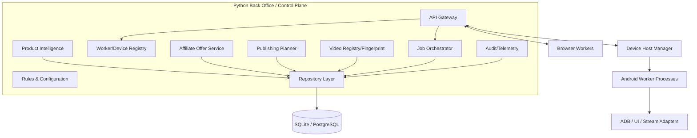
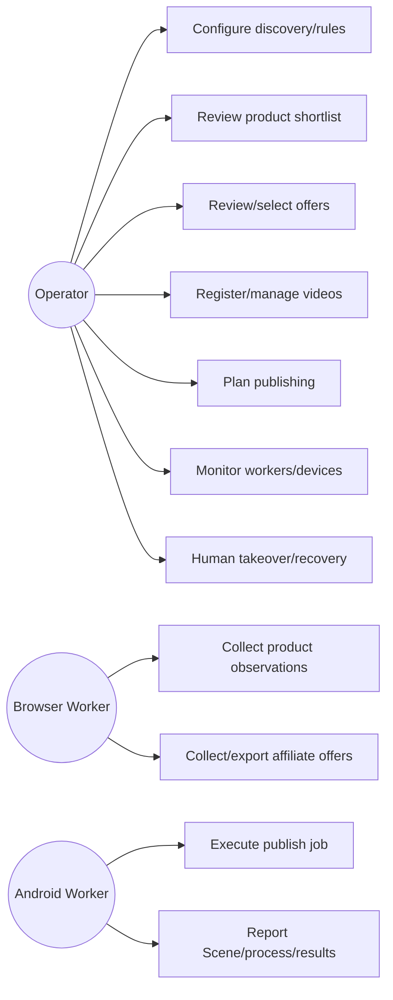
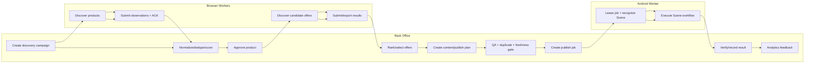
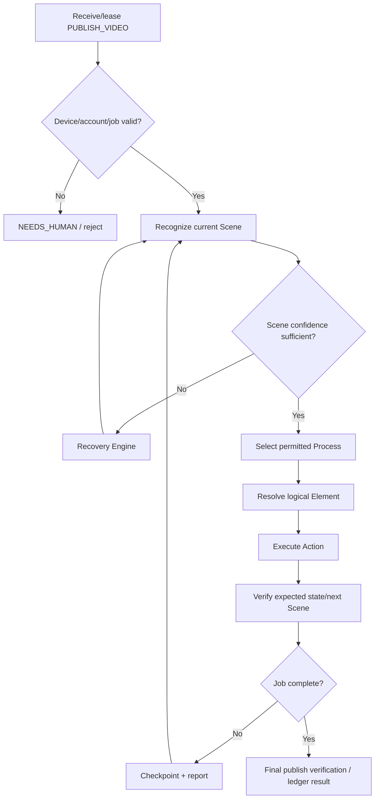
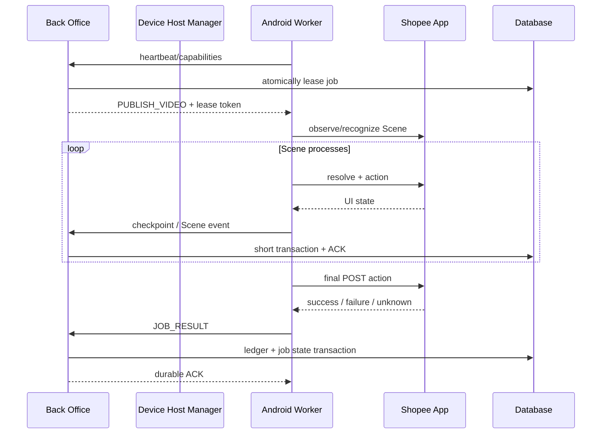
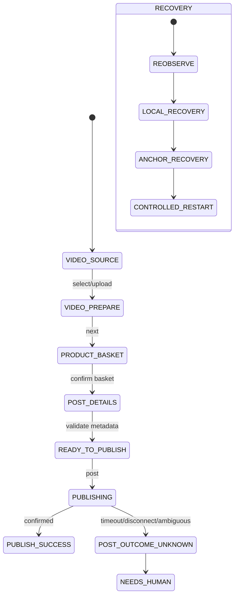
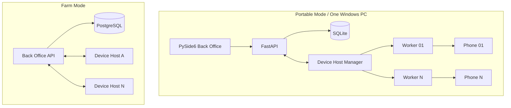
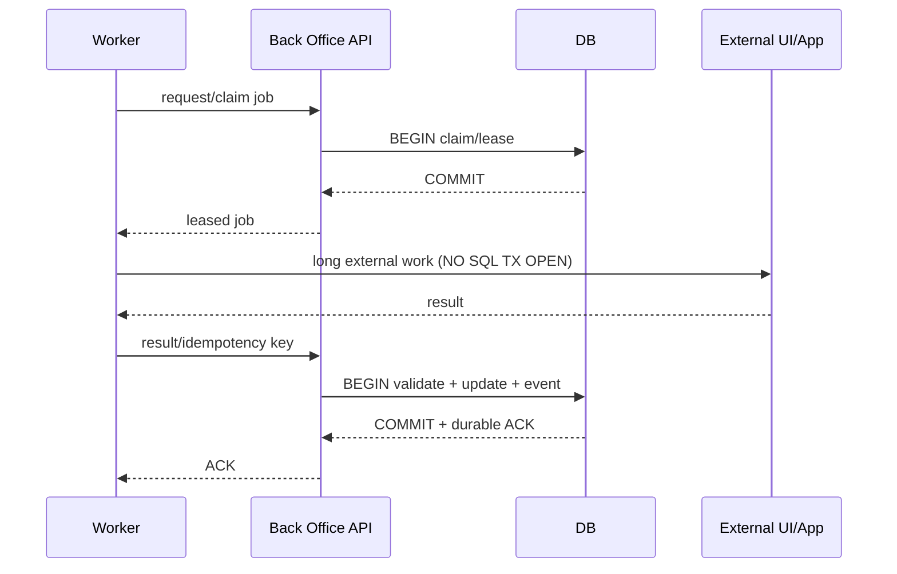
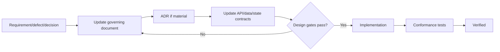

# System Diagrams

Status: DEVELOPMENT HANDOFF BASELINE
Notation: Mermaid diagrams are source-controlled documentation and must evolve with the architecture.

## 1. System Context

## 2. Component Diagram

## 3. Use Cases

## 4. End-to-End Swimlane

## 5. Step 3 Activity Diagram

## 6. Worker Job Sequence

## 7. Android Scene State Model

## 8. Deployment Diagram

## 9. Database Transaction Boundary

## 10. SSOT Change Flow

