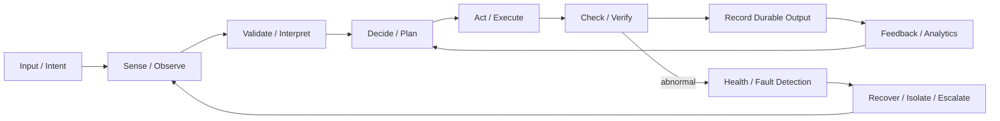
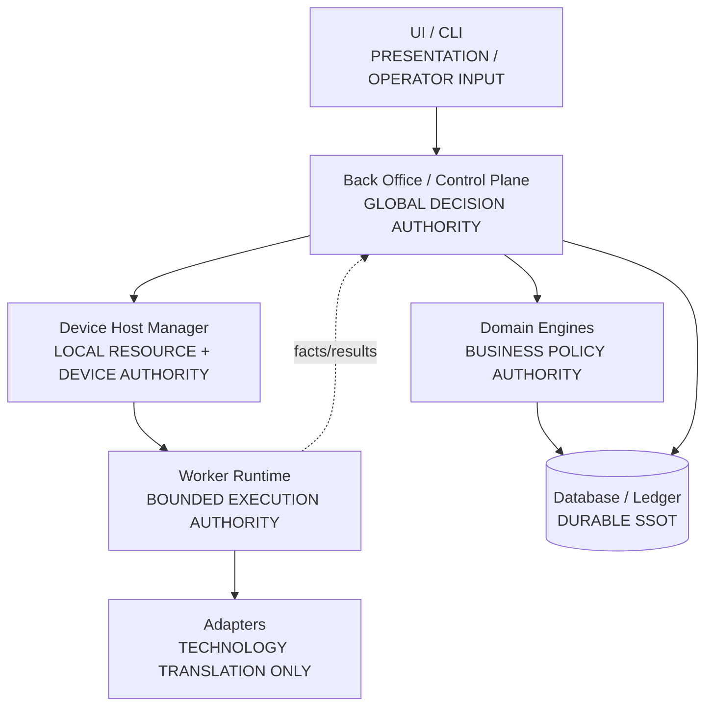
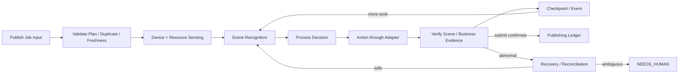
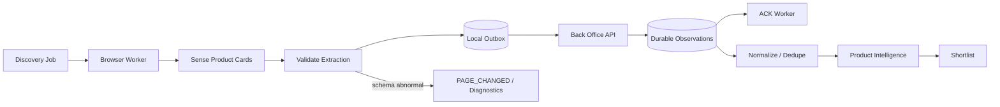

# System Physiology Model — Sense, Decide, Act, Verify, Recover

Status: IMPLEMENTATION HANDOFF BASELINE
Date: 2026-08-31
Governing rule: **Project must follow the document.**

## 1. Purpose

MTAffiliatePlatform is designed as a coordinated living system rather than a collection of unrelated scripts. Each component has a bounded responsibility, a clear owner, explicit inputs/outputs, a communication contract, health signals, failure behavior and recovery rules.

The governing control loop is:

```text
INPUT
  -> SENSE / OBSERVE
  -> VALIDATE / INTERPRET
  -> DECIDE / PLAN
  -> ACT / EXECUTE
  -> VERIFY
  -> OUTPUT / RECORD
  -> FEEDBACK / LEARN
  -> RECOVER / ADAPT when abnormal
```

This model does not replace domain architecture. It is an architectural review lens used to verify that the system can coordinate, detect abnormal conditions, contain failures, recover safely and continue operating.

## 2. Body-System Analogy

| Body concept | Platform responsibility |
|---|---|
| Brain / executive function | Back Office / Control Plane |
| Nervous system | REST API, worker protocol, WebSocket telemetry, local IPC |
| Memory | Canonical Database, Publishing Ledger, Audit/Event history |
| Sensory system | Browser observations, Scene Recognizer, health probes, telemetry |
| Organs | Domain Engines and application services |
| Muscles / limbs | Browser Workers, Android Workers, concrete adapters |
| Circulation | Job queue, event/result flow, outbox + durable ACK |
| Immune system | validation, policy gates, authentication, duplicate prevention, quarantine |
| Homeostasis | resource budgets, admission control, backpressure, rate/pacing policy |
| Healing / repair | recovery engine, retry, reconciliation, failover, checkpoint/resume |
| Doctor / escalation | NEEDS_HUMAN, operator takeover, diagnostics |
| DNA / governing instructions | SSOT documents, ADRs, versioned contracts/rulesets |

The analogy is explanatory only. Authoritative responsibilities remain defined by architecture and contracts.

## 3. System Control Loop



A component that performs irreversible work must never skip verification and durable recording.

## 4. Mandatory Component Anatomy

Every implementation-significant component must document these fields before Implementation Ready:

1. **Purpose** — why the component exists.
2. **Owner / authority** — who is allowed to make its decisions/state transitions.
3. **Inputs** — commands, events, observations, configuration and state consumed.
4. **Processing** — deterministic business behavior or execution responsibility.
5. **Outputs** — commands, events, read models, persisted state or external effects.
6. **Communication** — caller/callee, protocol, schema/version, ACK semantics.
7. **State** — volatile state vs durable authoritative state.
8. **Health signals** — heartbeat, latency, backlog, error rate, schema confidence, resource use, etc.
9. **Failure modes** — expected abnormal conditions and ambiguity classes.
10. **Recovery** — retry, checkpoint, reconciliation, quarantine, restart, failover or human escalation.
11. **Resource budget** — CPU/RAM/disk/network/USB/stream/session capacity where relevant.
12. **Test path** — unit/component/contract/fake/integration/resilience verification route.

Missing owner, health detection or recovery is a design defect, not a future operational detail.

## 5. Authority and Division of Labor



Rules:
- No adapter may promote itself into business-policy authority.
- No UI may own canonical business state.
- No worker may independently rewrite global business truth.
- No durable entity may have two independent lifecycle owners.

## 6. Sensory / Detection Layer

The platform must observe both business reality and system health.

### Business sensing
- product observations;
- offer observations;
- video/media metadata;
- Android Scene/UI hierarchy;
- publish-result evidence;
- performance/analytics observations.

### Operational sensing
- worker heartbeat;
- device online/offline state;
- queue age/backlog;
- local outbox depth;
- CPU/RAM/disk/USB/network pressure;
- parser/selector confidence;
- API latency/error rates;
- database conflict/retry metrics;
- stream health;
- version/schema compatibility.

False silence must not be interpreted as success. Example: zero parsed products after a page schema change is not a successful empty result unless the page is independently validated as genuinely empty.

## 7. Decision Layer

Decision authority belongs to deterministic/versioned engines and application services.

Examples:
- Product Intelligence Engine: qualify/score/rank/shortlist.
- Affiliate Offer Engine: eligibility/freshness/rank/preferred/backup.
- Shared Job Engine: job lifecycle, lease, retry classification.
- Content Identity Engine: exact/near duplicate classification.
- Publishing Engine: readiness, duplicate gate, submit guard, reconciliation policy.
- Scene Engine: scene confidence, expected transitions, bounded recovery.
- Resource Manager: admission/degradation decisions for a Device Host.

Every material decision must be explainable through inputs + ruleset/model version + output/reason.

## 8. Action / Execution Layer

Execution components act only within explicit authority:
- Browser Worker executes discovery/offer collection commands.
- Android Worker executes a validated publishing plan.
- UI Automation Adapter resolves semantic elements and performs atomic interactions.
- DeviceTransportAdapter handles device-level transport.
- Repository implementations persist through approved Unit of Work boundaries.

Actions with external side effects require idempotency and verification appropriate to their risk.

## 9. Verification Layer

Verification is mandatory after meaningful effects.

Examples:
- observation batch: verify durable DB commit before ACK;
- lease: verify token/version/expiry;
- Scene action: verify expected UI state/next Scene;
- product basket: verify selected target identity, not merely that a checkbox changed;
- publish: verify post-success evidence before ledger success;
- migration: verify schema revision and compatibility;
- worker spawn: verify process heartbeat + device binding.

The system must distinguish `action issued` from `outcome confirmed`.

## 10. Homeostasis / Resource Management

The system must remain stable under varying load rather than chase maximum throughput.

Resource-managed areas include:
- CPU;
- RAM;
- disk capacity and log retention;
- worker outbox capacity;
- USB bandwidth/device stability;
- screen-stream bandwidth/encoding load;
- database writer pressure;
- API queue/backlog;
- browser/session capacity.

Homeostasis policy:

```text
NORMAL
  -> PRESSURED
  -> THROTTLED / DEGRADED
  -> DRAINING
  -> RECOVERED
```

When pressure exceeds safe admission thresholds, stop accepting new work before destabilizing active work.

Priority:
`Correctness > Recoverability > Traceability > Stable Throughput > Maximum Throughput`.

## 11. Immune / Protection Layer

Protection mechanisms detect or block harmful state transitions:
- schema/contract validation;
- worker authentication/enrollment;
- capability validation;
- duplicate publication guards;
- eligibility/freshness gates;
- optimistic concurrency/version checks;
- unique database invariants;
- selector/page schema change detection;
- quarantine of unhealthy workers/adapters;
- configuration/ruleset version checks;
- permission/compliance boundaries.

A detected incompatible component should be isolated or rejected, not allowed to continue with guessed behavior.

## 12. Healing / Recovery Layer

Recovery is layered and bounded.

General recovery hierarchy:

```text
1. Re-observe / refresh local state
2. Retry safe idempotent operation
3. Resume from durable checkpoint
4. Reassign after lease expiry when safe
5. Navigate to known safe anchor
6. Restart isolated worker/app component
7. Quarantine unhealthy component
8. Reconcile ambiguous external outcome
9. NEEDS_HUMAN / operator takeover
```

Recovery must never create a second irreversible side effect merely because the first response was lost.

## 13. Example — Step 3 Physiology



This demonstrates Input -> Process -> Output plus sensing, control, verification, memory and healing.

## 14. Example — Step 1 Physiology



## 15. Component Health State Model

Recommended common health vocabulary:

```text
HEALTHY
DEGRADED
PRESSURED
UNHEALTHY
QUARANTINED
OFFLINE
UNKNOWN
```

Business execution eligibility is not identical to process liveness. A process may be online but `DEGRADED` or `QUARANTINED` and therefore ineligible for new jobs.

## 16. Health Event Contract

Health reporting should be normalized around:
- component_id;
- component_type;
- host/device context;
- health_state;
- reason_code;
- observed_at;
- current_job_id when relevant;
- metrics snapshot/reference;
- component/runtime/adapter version;
- recommended action;
- correlation_id.

Health events are operational facts. Back Office/Host policy decides admission/quarantine/recovery.

## 17. Failure Containment Zones

Failure should remain inside the smallest possible zone:

```text
Adapter failure
  -> Worker affected
  -> Device affected if necessary
  -> Device Host only if shared resource failure
  -> Control Plane only for central dependency failure
```

One broken phone, parser, worker or stream must not crash unrelated workers or corrupt the central ledger.

## 18. Observability Requirements

Every critical flow must provide sufficient telemetry to answer:
- What was requested?
- Which component processed it?
- What rules/version were used?
- What external action occurred?
- Was the result verified?
- What state changed durably?
- What failed?
- What recovery occurred?
- Is human intervention required?

Use correlation IDs, job IDs, worker/device IDs and append-oriented audit events.

## 19. Testability of Physiology

The architecture must support deterministic simulation of sensing, faults and recovery.

Required fake-driven scenarios include:
- sensor/observation missing;
- stale observation;
- worker heartbeat loss;
- ACK loss;
- duplicate result delivery;
- resource pressure;
- DB optimistic concurrency conflict;
- parser/selector schema change;
- device disconnect;
- wrong/unknown Scene;
- worker crash;
- external action timeout;
- publish outcome unknown;
- operator/human takeover.

The same application/engine code must run with fake and real adapters.

## 20. Implementation Readiness Rule

A component or integration cannot be declared Implementation Ready if any of the following is undefined:
- responsibility/owner;
- input/output contract;
- durable-state authority;
- health signal;
- failure classification;
- recovery/escalation path;
- resource/admission considerations where relevant;
- test-double path.

This rule is part of the architecture quality gate.
